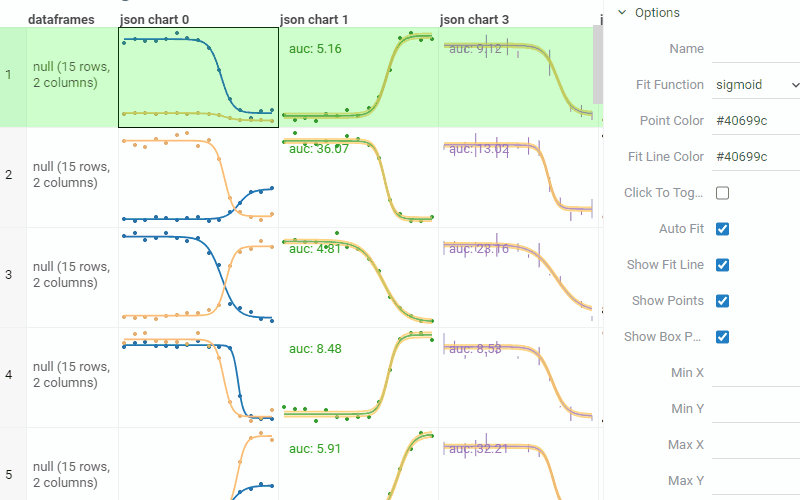
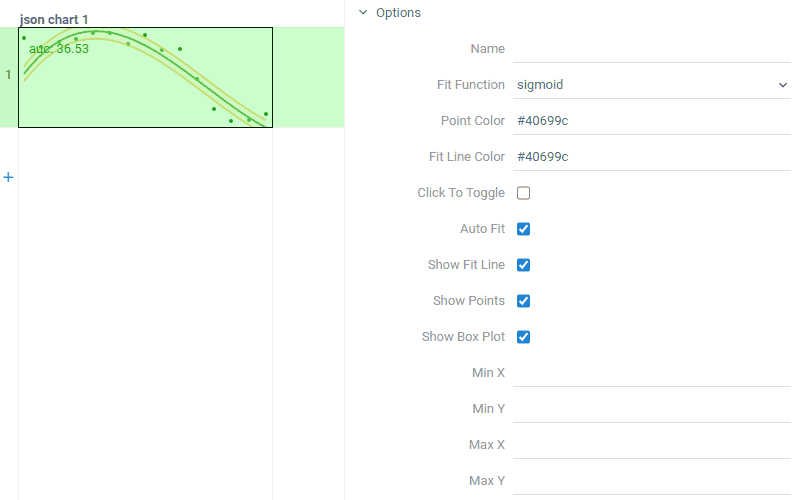
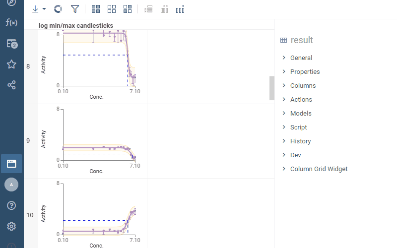
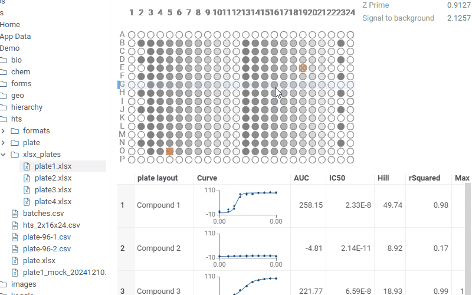
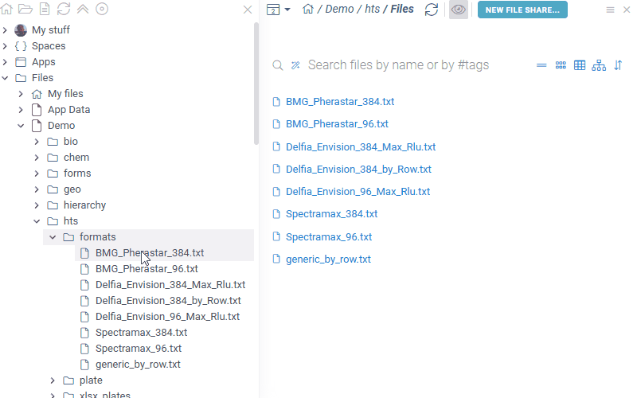

# Curves

**Curves** provides support for dose-response curves,
including charts in cells, interactivity, and automatic fitting.
Also, it integrates with assay plates, allowing you to 
[read data directly from instruments](#plate-readers), and visualize
[dose-response curves from assay plates](#integration-with-assay-plates).

- Fitting: computing parameters of the specified function to best fit the data
  - For dose-response curves, we are typically fitting the sigmoid function
  - Ability to dynamically register custom fitting functions
    - Automatic fit function determination
    - Caching of custom fitting functions
  - Ability to get fitting performance characteristics (r-squared, classification, etc.)
- Deep integration with the Datagrok grid
  - Either fitting on the fly or using the supplied function + parameters
  - Multiple series in one cell
  - Candlesticks, confidence intervals, standard deviation and droplines drawing
  - Ability to define chart, marker, or fitting options (such as fit function or marker color)
      on the column level, with the ability to override it on a grid cell or point level
  - Clicking a point in a chart within a grid makes it an outlier -> curve is re-fitted on the fly
  - Ability to switch curves parameters from the property panel on different levels (dataframe, column, cell)
  - Ability to specify a chart as a "reference" so that it is shown on every other chart for comparison
- Ability to overlay curves from multiple grid cells (special viewer)
- Work with series stored in multiple formats (binary for performance, JSON for flexibility, etc.)

## Data format

To render a fitted curve, the cell has to contain a string in the following JSON format:

<details>
<summary> Example of the JSON chart cell </summary>
```json
{
  "series": [
    {
      "name": "Test series",
      "pointColor": "#2ca02c",
      "fitLineColor": "#2ca02c",
      "confidenceIntervalColor": "#fbec5d",
      "outlierColor": "#d62728",
      "markerType": "circle",
      "outlierMarkerType": "outlier",
      "lineStyle": "dashed",
      "errorModel": "proportional",
      "connectDots": false,
      "showFitLine": true,
      "showCurveConfidenceInterval": true,
      "fitFunction": "sigmoid",
      "parameters": [1.7391934768969721, -0.9451759934029763, 4.846020678949615, 0.15841886339211816],
      "parameterBounds": [
        {"min": 1.739193476892, "max": 1.739193476898},
        {"max": -0.9451759934029},
        {},
        {"min": 0.158418863392114}
      ],
      "showPoints": "points",
      "clickToToggle": true,
      "droplines": ["IC50"],
      "points": [
        { "x": 0.10000000149011612, "y": 0.04152340441942215, "stdev": 0.031523404876, "marker": "square", "outlierMarker": "square" },
        { "x": 0.6000000238418579, "y": 0.11901605129241943, "outlier": true, "outlierColor": "#ff7f0e" },
        { "x": 1.100000023841858, "y": 0.11143334954977036, "outlier": false, "color": "#2ca02c", "size": 5 },
        // ...
      ]
    }
  ],
  "chartOptions": {
    "showStatistics": ["auc", "rSquared"],
    "minX": 0.10000000149011612,
    "minY": 0.04152340441942215,
    "maxX": 7.099999904632568,
    "maxY": 1.7591952085494995,
    "title": "Dose-Response curves",
    "xAxisName": "Concentration",
    "yAxisName": "Activity",
    "logX": true,
    "logY": false,
    "allowXZeroes": true,
    "mergeSeries": false,
    "showColumnLabel": true
  }
}
```
</details>

Each series has its own parameters, such as:

- `name` - controls the series name
- `pointColor` - overrides the standardized series point color
- `fitLineColor` - overrides the standardized series fit line color
- `confidenceIntervalColor` - overrides the standardized series confidence interval color
- `outlierColor` - overrides the standardized series outlier color
- `markerType` - defines the series marker type, which could be `circle`, `asterisk`, `square`, etc.
- `outlierMarkerType` - defines the series outlier marker type, which could be `circle`, `outlier`, `square`, etc.
- `lineStyle` - defines the series line style, which could be `solid`, `dotted`, `dashed` or `dashdotted`
- `errorModel` - defines the series error model, which could be either `constant`, `proportional` or `combined`
- `connectDots` - defines whether to connect the points with lines or not
- `showFitLine` - defines whether to show the fit line or not
- `showCurveConfidenceInterval` - defines whether to show the confidence intervals or not
- `fitFunction` - controls the series fit function, which could be either a sigmoid, linear, log-linear function or a
[custom-defined function](/README.md#creating-custom-fit-function).
- `parameters` - controls the series parameters, if set explicitly - the fitting process won't be executed. The parameter order of the
sigmoid function is: `max, tan, IC50, min`.
- `parameterBounds` - defines the acceptable range of each parameter, which is taken into account during the fitting. See also `parameters`
- `showPoints` - defines the data display mode, which could be either `points`, `candlesticks`, `both`, or none
- `clickToToggle` - defines whether clicking on the point toggles its outlier status and causes curve refitting or not
- `droplines` - defines the droplines that would be shown on the plot (for instance, IC50)
- `points` - an array of objects with each object containing `x` and `y` coordinates and its own parameters:
  - `outlier` - if true, renders as 'x' and gets ignored for curve fitting
  - `color` - overrides the marker color defined in series `pointColor`
  - `marker` - overrides the marker type defined in series `markerType`
  - `outlierMarker` - overrides the outlier marker type defined in series `outlierMarkerType`
  - `size` - overrides the default marker size
  - `stdev` - when defined, renders an error bar candlestick

Each chart has its own parameters as well, such as:

- `minX`, `minY`, `maxX`, `maxY` - controls the minimum x and y values of the plot
- `title` - defines the plot title. If the plot size is enough, will render it
- `xAxisName`, `yAxisName` - defines the x and y axis names. If the plot size is enough, will render it
- `logX`, `logY` - defines whether the x and y data should be logarithmic or not
- `allowXZeroes` - defines whether x zeroes allowed for logarithmic data or not. If the flag is true, it will calculate the approximate log(0) that will fit the chart
- `mergeSeries` - defines whether to merge series or not
- `showColumnLabel` - defines whether to show the column label in the legend or not
- `showStatistics` - defines the statistics that would be shown on the plot (such as the area under the curve
(`auc`) or the coefficient of determination (`rSquared`))



## Creating a custom fit function

To render a custom fit function, you need to write in the following JSON format:

```json
"fitFunction": {
  "name": "Polynomial",
  "function": "([p1, p2, p3, p4], x) => p1 * x * x * x + p2 * x * x + p3 * x + p4",
  "getInitialParameters": "(xs, ys) => [0.1, -1, 4, 4]",
  "parameterNames": ["Slope", "Intercept", "Parameter 3", "Parameter 4"]
}
```

Each fitting function has its own `name`, which is used to cache the created custom function, enabling
efficient retrieval and reuse, and `parameterNames`, which are stored as an array of strings.

Also, there are two functions: `getInitialParameters`, which takes arrays of x and y and returns determined
initial parameter values, and `function`, which takes the array of parameters and the given x coordinate and
returns the result of the fit function. These functions are written as JavaScript arrow function expressions.



## Multi Curve Viewer

To compare dose-response curves from multiple cells, put them on the Multi Curve Viewer::



## Integration with assay plates

For a number of commonly used formats representing assay plates, Curves automatically detects
layout, concentration, and activity layers, and shows you plate content in the form of automatically
fitted dose-response curves.

While typically such functionality gets integrated into custom apps (for instance, for doing
the quality control, registering experiments to ELN, etc), this is quite useful for
previewing plates. In this picture, excel files are recognized as containing assay plate data,
and we can see dose-response curves in the file preview. 



## Plate readers

The package provides support for some of the common plate formats produced by instruments, such 
as **BMG Pherastar**, **Delfia Envision**, and **Spectramax**. The detection / parsing mechanism
is extensible, so you can easily write your own reader - [see examples](src/plate/plate-reader.ts).




See also:

- [Packages](../../help/develop/develop.md#packages)
- [JavaScript API](../../help/develop/packages/js-api.md)
