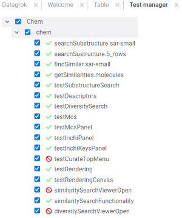

# DevTools

DevTools is a [package](https://datagrok.ai/help/develop/develop#packages) for the [Datagrok](https://datagrok.ai)
platform. Its purpose is to simplify and assist in the development of platform extensions. This is achieved through
familiarizing developers with Datagrok's [object](https://datagrok.ai/help/overview/objects) model and providing them
with reproducible code snippets that fit their data. This approach allows to explore the key functionality from the
interface, learn by example, jump to the [documentation](https://datagrok.ai/help/)
or [API](https://datagrok.ai/js-api/) reference in one click, and much more. It also helps focus on the problem you are
trying to solve: you can interact with your data from the outset while some of the program's building blocks are
generated for you.

Components:

  1. `Dev` [info panel](https://datagrok.ai/help/discover/info-panels).
     It appears in the property panel whenever an entity becomes the current object. Under `Dev`, you will find links to the documentation and the object's class reference, a set of examples dynamically loaded from the [ApiSamples](https://github.com/datagrok-ai/public/tree/master/packages/ApiSamples) package, and an editor with a template script with most common actions for this type of entity.

     

     In the first line, you will see the type and name of an object followed by two icons. The first one opens Datagrok's script editor with a few lines of code that obtain the object and save it to a variable. The second one logs the object to the browser's console.
     The next section contains links to documentation and the class reference. Below it, there are examples for the entity you are working with. Since some objects, such as dataframes, have a lot of applications, examples are grouped for them, with a choice input to switch between the groups. When you click on an example, it gets shown in the built-in editor. Use the 'Play' button to run the code and 'Reset' to bring the default template back. Other options let you copy the content or open it in the platform's full-scale script editor.
  2. The [viewers](https://datagrok.ai/help/visualize/viewers)' context menu command `To JavaScript`.
     It helps retrieve viewer options set from the interface. To use it, open a viewer and customize its appearance. Once this step is complete, choose the command from the menu:

     

     The command outputs a code snippet that adds a viewer of this type to the current view. The options you selected are saved and passed to the `addViewer` method. See the [How to manipulate viewers](https://datagrok.ai/help/develop/how-to/manipulate-viewers) article to learn more about API to work with viewers.

   3. `Test manager` is a component that provides an interface for running package unit tests and further results exploration.
   To start `Test manager` you should go to top menu `Tools` -> `Dev` -> `Test manager`
   
   

   After starting the tool you will see a list of all package tests divided by package name. Inside each package, the tests
   are divided by category. Using checkboxes you can choose which tests you want to run at a time. You can choose either
   the whole package or required category or exact tests inside a category. After all required tests are selected click on
   the `RUN` button at the top.

   

   Failed tests are marked with a red cancel sign while passed tests are marked with a green tick mark.

   

   You can get more detailed information on test results by clicking on a test/category/package name. Information will be
   shown on a property panel.

   

See also:
  - [JavaScript Development](https://datagrok.ai/help/develop/develop) 
  - [JavaScript API Samples](https://public.datagrok.ai/js)
  - [Entities](https://datagrok.ai/help/overview/objects)
  - [Info Panels](https://datagrok.ai/help/discover/info-panels)
  - [How to add an info panel](https://datagrok.ai/help/develop/how-to/add-info-panel)
  - [Viewers](https://datagrok.ai/help/visualize/viewers)
  - [How to manipulate viewers](https://datagrok.ai/help/develop/how-to/manipulate-viewers)
