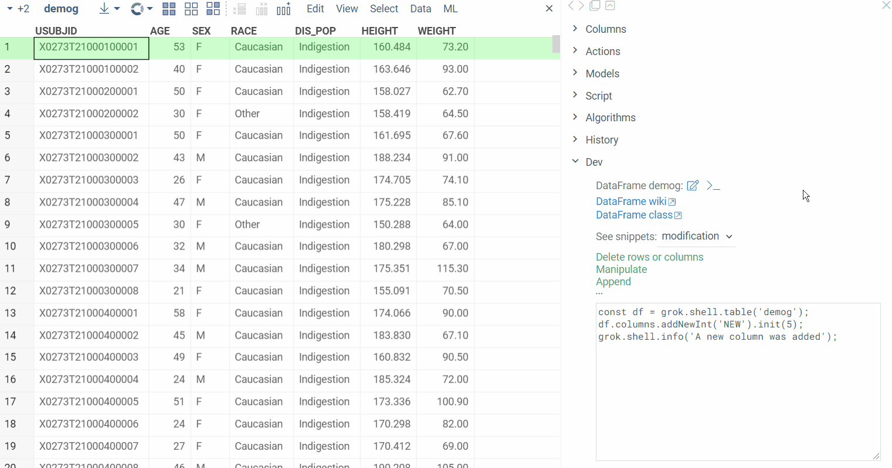
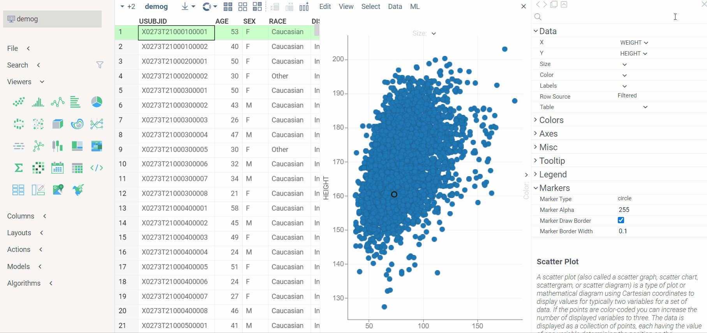
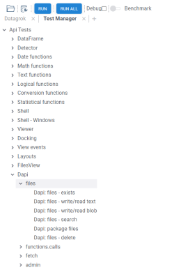
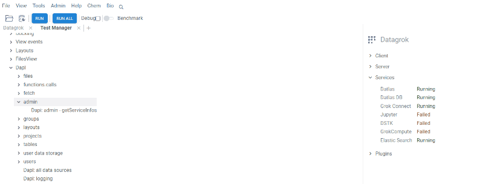
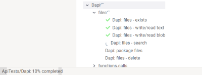

# Dev Tools

Dev Tools is a [package](https://datagrok.ai/help/develop/#packages) for the [Datagrok](https://datagrok.ai)
platform. Its purpose is to simplify and assist in the development of platform extensions. This is achieved through
familiarizing developers with Datagrok's [object](https://datagrok.ai/help/datagrok/concepts/objects) model and providing them
with reproducible code snippets that fit their data. This approach allows to explore the key functionality from the
interface, learn by example, jump to the [documentation](https://datagrok.ai/help/)
or [API](https://datagrok.ai/js-api/) reference in one click, and much more. It also helps focus on the problem you are
trying to solve: you can interact with your data from the outset while some of the program's building blocks are
generated for you.

## Components

  1. `Dev` [info panel](https://datagrok.ai/help/explore/data-augmentation/info-panels).
     It appears in the context panel whenever an entity becomes the current object. Under `Dev`, you will find links to the documentation and the object's class reference, a set of examples dynamically loaded from the [ApiSamples](https://github.com/datagrok-ai/public/tree/master/packages/ApiSamples) package, and an editor with a template script with most common actions for this type of entity.

     

     In the first line, you will see the type and name of an object followed by two icons. The first one opens Datagrok's script editor with a few lines of code that obtain the object and save it to a variable. The second one logs the object to the browser's console.
     The next section contains links to documentation and the class reference. Below it, there are examples for the entity you are working with. Since some objects, such as dataframes, have a lot of applications, examples are grouped for them, with a choice input to switch between the groups. When you click on an example, it gets shown in the built-in editor. Use the 'Play' button to run the code and 'Reset' to bring the default template back. Other options let you copy the content or open it in the platform's full-scale script editor.
  2. The [viewers](https://datagrok.ai/help/visualize/viewers)' context menu command `To JavaScript`.
     It helps retrieve viewer options set from the interface. To use it, open a viewer and customize its appearance. Once this step is complete, choose the command from the menu:

     

     The command outputs a code snippet that adds a viewer of this type to the current view. The options you selected are saved and passed to the `addViewer` method. See the [How to manipulate viewers](https://datagrok.ai/help/develop/how-to/manipulate-viewers) article to learn more about API to work with viewers.

  3. `Test manager` is a component that provides an interface for running package unit tests and further results exploration.
   To start `Test manager` go to top menu `Tools` -> `Dev` -> `Test manager`

   

   Application starts showing a list of all packages containing unit tests. Inside each package, tests
are divided by category. Categories support multiple nesting (subcategories should be divided by `:`).
To select a test or a category, click on it, or use keyboard.

## Running tests

There are multiple ways you can run tests:

- by right clicking on package, category, or test and selecting `Run` from context menu
- by selecting package, category, or test and pushing `Enter`
- by selecting package, category, or test and pushing `Run` on a ribbon panel
- by selecting package, category, or test and pushing `Run` on a context panel
- individual tests can be run by double click
- you can run all tests at once using `Run all` button on the ribbon
- package, category, or test can be run by putting the corresponding url into address bar of the browser. The format is the following `your_server_name/apps/DevTools/TestManager/package_name/category_name/test_name`
 Progress icon is shown opposite to active test/category/package, it will end up in result icon after completion. In case at least one test fails within category or package the fail icon will be shown.

Progress bar on the bottom of the page will show the percentage of completed tests.

## Reviewing results

Information about test results is available via tooltip or in the context panel. Selected test, category, or package to explore results.
In case category/package contain multiple tests results are shown as a grid which can be added to workspace for further exploration.

See also:

- [JavaScript Development](https://datagrok.ai/help/develop)
- [JavaScript API Samples](https://public.datagrok.ai/js)
- [Entities](https://datagrok.ai/help/datagrok/concepts/objects)
- [Info Panels](https://datagrok.ai/help/explore/data-augmentation/info-panels)
- [How to add an info panel](https://datagrok.ai/help/develop/how-to/add-info-panel)
- [Viewers](https://datagrok.ai/help/visualize/viewers)
- [How to manipulate viewers](https://datagrok.ai/help/develop/how-to/manipulate-viewers)
