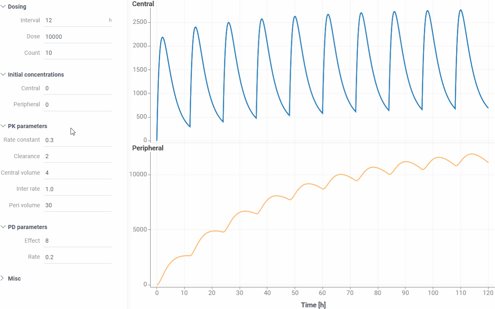
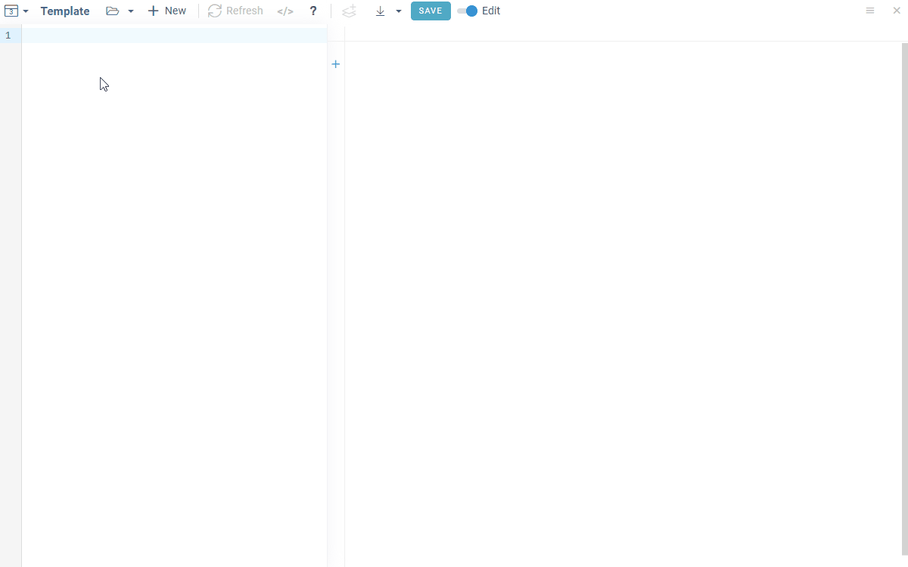
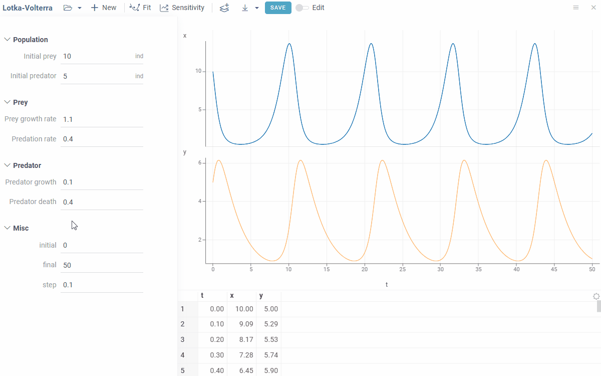
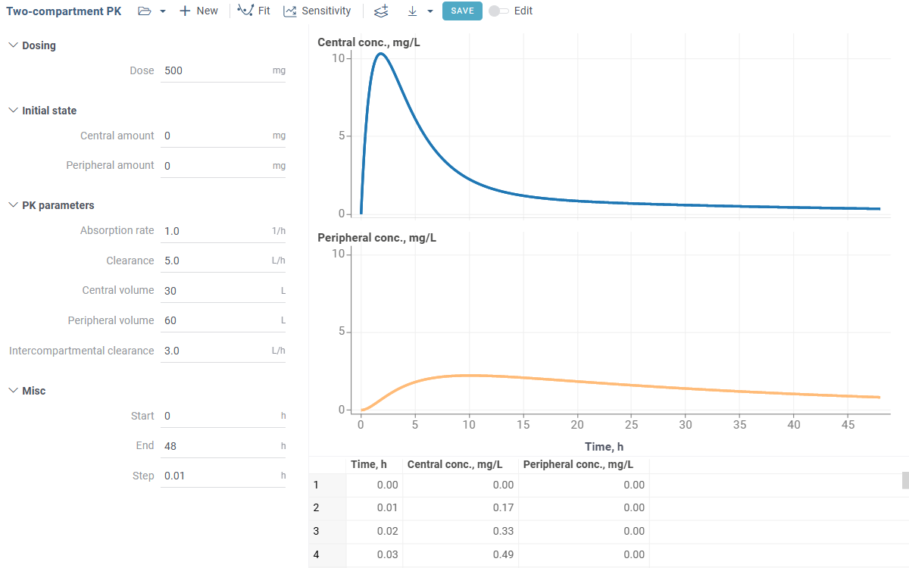
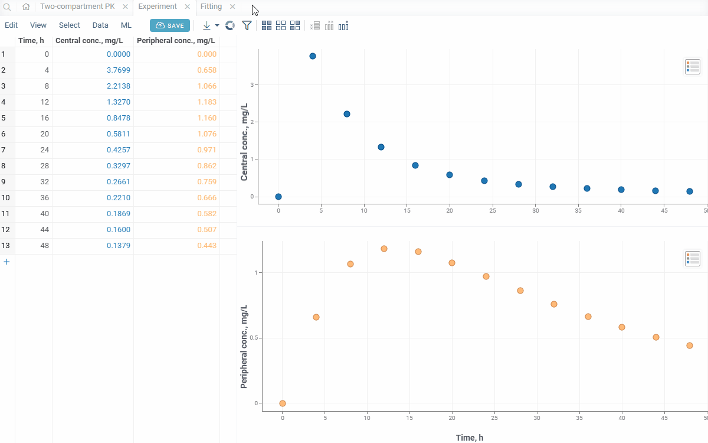
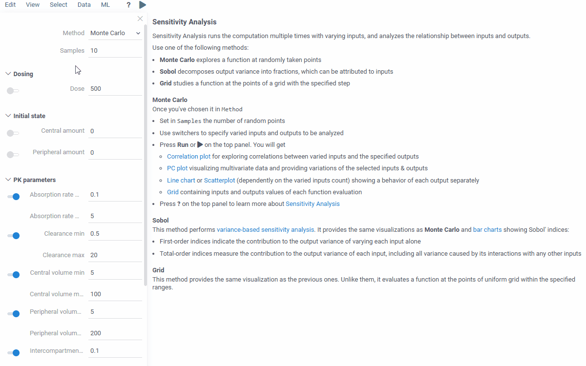
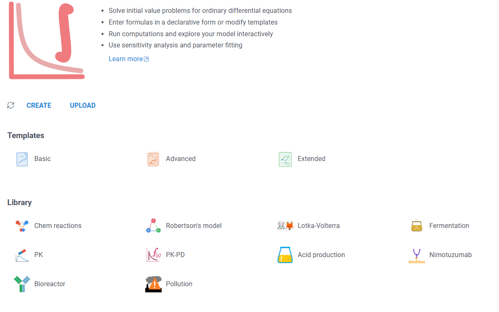

# Write the Math, Get the App: Solving ODEs in the Browser Without Code

*Diff Studio is an environment for building ODE models and a place where they live afterwards. This is a walkthrough from the first equation to a shared library.*

---

## The gap between the math and the model

The equations are done. They fit on half a page. You know what the system should do.

Then you pick a solver, write the integration loop, set up the plotting, wrap it all in a notebook. A week later a colleague asks whether the curve changes much at a different dose, and you either run it for them by hand or start building a small UI you never intended to build.

I've been on both sides of this. The script works, but the only person who can actually use it is the one who wrote it. Biologists, clinicians, process engineers, students - the people who need answers from the model - don't open scripts.

This post is about a workflow where you write the equations roughly the way you'd write them on paper and get an interactive model in the browser right away: sliders for the parameters, live plots, fitting to experimental data, sensitivity analysis, and a URL you can send to someone who has never written code.

The tool is **Diff Studio**, part of the [Datagrok](https://datagrok.ai) platform. Its solver engine, [Diff Grok](https://github.com/datagrok-ai/diff-grok), is open source (MIT).

*Disclosure: I work at Datagrok. Everything below runs in the free public instance, so you can follow along: [public.datagrok.ai/apps/DiffStudio](https://public.datagrok.ai/apps/DiffStudio).*



Plan for the post:

- a working model from a dozen lines of plain text,
- parameters that turn into UI controls,
- a two-compartment PK model,
- fitting, sensitivity analysis and sharing,
- how models accumulate into a library the whole team can use.

---

## Your first model in 60 seconds

Open Diff Studio (**Apps > Diff Studio**), pick the **Basic** template or switch on the **Edit** toggle, and replace the text with the predator–prey system:

```
#name: Lotka-Volterra

#equations:
  dx/dt = alpha * x - beta * x * y
  dy/dt = delta * x * y - gamma * y

#inits:
  x = 10
  y = 5

#argument: t
  initial = 0
  final = 50
  step = 0.1

#parameters:
  alpha = 1.1
  beta = 0.4
  delta = 0.1
  gamma = 0.4
```

Press **F5** (or click **Refresh**). You get two plots and a results table.



What the blocks mean:

- **`#name`** - model identifier; shows up in the tab and later in the library.
- **`#equations`** - the system. Derivatives are written as `dx/dt`; variable names can be anything, including multi-letter ones; math notation is the usual `*`, `/`, `exp()`, `cos()` and so on.
- **`#inits`** - initial conditions for every function you're solving.
- **`#argument`** - the independent variable, its range, and the output step.
- **`#parameters`** - quantities from the equations that you want to be able to change. Each becomes an input in the UI. (Values that should stay fixed go under `#constants`, see below.)

You don't choose a solver or set tolerances. The default handles stiff and non-stiff systems; you can override it later if you need to.

Comments go after `//`. The model is plain text, so you can download it as an `.ivp` file, edit it in any editor, keep it in git, or paste it into a chat.

---

## The same model in Python

For comparison, here is the same thing with SciPy:

```python
import numpy as np
from scipy.integrate import solve_ivp
import matplotlib.pyplot as plt

alpha, beta, delta, gamma = 1.1, 0.4, 0.1, 0.4

def rhs(t, z):
    x, y = z
    return [alpha * x - beta * x * y,
            delta * x * y - gamma * y]

t_eval = np.linspace(0, 50, 1001)
sol = solve_ivp(rhs, (0, 50), [10, 5], t_eval=t_eval)

plt.plot(sol.t, sol.y[0], label="x (prey)")
plt.plot(sol.t, sol.y[1], label="y (predator)")
plt.xlabel("t"); plt.legend(); plt.show()
```

This is fine. SciPy is excellent, and if you need a custom pipeline around the solver, Python or Julia is where you should be.

Still, two lines of this are the model and the rest is plumbing: unpacking the state vector, building the time grid, calling the integrator, labeling the plot. And the moment you want to try several values of `beta`, each one is an edit and a rerun. In Diff Studio it's a slider. Although, to be fair, a slider labeled `beta` with no range isn't much of a UI yet. Let's fix that.

---

## Parameters become the interface

The model has four inputs, but they are bare number fields labeled with variable names. Annotations in curly braces after the value tell Diff Studio how to render them:

```
#parameters:
  alpha = 1.1 {min: 0; max: 3; step: 0.05; caption: Prey growth rate; category: Prey}
  beta  = 0.4 {min: 0; max: 2; step: 0.05; caption: Predation rate;   category: Prey}
  delta = 0.1 {min: 0; max: 1; step: 0.01; caption: Predator growth;  category: Predator}
  gamma = 0.4 {min: 0; max: 2; step: 0.05; caption: Predator death;   category: Predator}

#inits:
  x = 10 {min: 1; max: 50; caption: Initial prey;     category: Population; units: ind}
  y = 5  {min: 1; max: 50; caption: Initial predator; category: Population; units: ind} [Number of predators at t = 0]
```

Switch off the Edit toggle to see the result.



- **`min` / `max`** make a slider; **`step`** sets the increment.
- **`caption`** is the label users see instead of `alpha`.
- **`category`** groups inputs into collapsible sections.
- **`units`** are shown next to the field. Cosmetic, but it saves a lot of "is this hours or minutes?" questions.
- **`[ ... ]`** after the annotation is a tooltip.

The same annotations work in `#argument`, so `initial`, `final` and `step` can get captions and ranges too.

Two more things:

**`#parameters` vs `#constants`.** Both are named values usable in equations; the difference is only whether they show up in the UI. A physical constant, or anything users shouldn't touch, goes to `#constants`:

```
#constants:
  K = 100   // carrying capacity, fixed for this study
```

**Sliders are live.** Every move re-solves the system and updates the plot. For a model like this the update is effectively instant, and that's what makes exploring the model feel different from "edit, rerun, look".

At this point you have an interactive predator–prey app with no code in it, just equations and labels. Anyone who understands what "prey growth rate" means can use it.

---

## A real example: two-compartment pharmacokinetics

Diff Studio ships with a **Library**: PK and PK-PD models, a bioreactor, fermentation, chemical kinetics, and a few classic stiff benchmarks (Robertson, HIRES). The model below is a compact variant of the PK example there. You can paste it in as is.

Two compartments with first-order absorption from the gut:

```
#name: Two-compartment PK

#equations:
  dA_gut/dt  = -ka * A_gut
  dA_c/dt    =  ka * A_gut - (CL / Vc) * A_c - Q * (A_c / Vc - A_p / Vp)
  dA_p/dt    =  Q * (A_c / Vc - A_p / Vp)

#expressions:
  C_central    = A_c / Vc
  C_peripheral = A_p / Vp

#inits:
  A_gut = 500 {caption: Dose; units: mg; category: Dosing; min: 0; max: 1000}
  A_c   = 0   {caption: Central amount;    units: mg; category: Initial state}
  A_p   = 0   {caption: Peripheral amount; units: mg; category: Initial state}

#parameters:
  ka = 1.0 {caption: Absorption rate;     units: 1/h;  category: PK parameters; min: 0.1; max: 5}
  CL = 5.0 {caption: Clearance;           units: L/h;  category: PK parameters; min: 0.5; max: 20}
  Vc = 30  {caption: Central volume;      units: L;    category: PK parameters; min: 5;   max: 100}
  Vp = 60  {caption: Peripheral volume;   units: L;    category: PK parameters; min: 5;   max: 200}
  Q  = 3.0 {caption: Intercompartmental clearance; units: L/h; category: PK parameters; min: 0.1; max: 20}

#argument: t
  initial = 0  {caption: Start; units: h}
  final   = 48 {caption: End;   units: h}
  step    = 0.1 {caption: Step; units: h}

#output:
  t            {caption: Time, h}
  C_central    {caption: Central conc., mg/L}
  C_peripheral {caption: Peripheral conc., mg/L}
```



Two new blocks.

**`#expressions`** are quantities computed from the state, parameters and time, without ODEs of their own. PK is the obvious case: the equations are written in amounts, but nobody plots amounts, they plot concentrations. So you define `C_central = A_c / Vc` once and use it anywhere, including in the output.

**`#output`** controls what goes to the results table and the chart. By default Diff Studio shows every solved function; here we hide the raw amounts and show only the concentrations, with proper column headers. Anything from `#equations` or `#expressions` can be listed.

Now set the dose to 250 mg and halve the clearance. Two slider moves, and you see the peak and the tail change. A pharmacologist can do this without ever looking at the equations.

---

## The parts that are hard to bolt onto a script

A model in a notebook answers the questions its author thought of. Three things people ask next, and what happens in Diff Studio.

### Fitting: which parameters explain my data?

You have measured concentrations at a few time points and want the PK parameters that reproduce them. Click **Fit** on the top panel, load a table with the observed values, choose which parameters may vary and within what ranges, run.

Diff Studio searches the parameter space, reports the goodness of fit and overlays the fitted curve on the data.



The model text doesn't change. Fitting works for any Diff Studio model; you don't implement it per model.

The case that sold me on this was a bioreactor model with several kinetic constants we couldn't find in the literature but could fit to our own experimental runs. Rough physical bounds, a table of measurements, one click - and the constants came out. The fit ran in a browser tab on my laptop: Diff Studio spreads the optimization across Web Workers, so the thousands of model evaluations run in parallel on the machine's own cores, no server involved.

### Sensitivity analysis

Click **Sensitivity**, choose the inputs to vary and the outputs to watch, pick Monte Carlo, Sobol or Grid, run. The result shows how strongly each parameter drives each output, which is usually the first thing a reviewer wants to know.



Same panel for the predator–prey toy and for a 20-equation bioreactor.

### Sharing a run

A run, with its parameter values, is encoded in the URL. Copy the link from the address bar and send it. The recipient opens the exact run you were looking at and can start moving sliders. Nothing to install, no notebook to re-execute.

For a paper or a report, the **Download** menu exports the model to Markdown or LaTeX with the equations typeset.

---

## From one model to a hub

A link solves the problem for one model and one colleague. The bigger problem, at least everywhere I've seen, is that ODE models live in scattered scripts, notebooks and spreadsheets, each with its own author and its own way of running. Nobody is sure which bioreactor model is current, and the PK model from last year's project gets rebuilt from scratch because nobody can find it.

Diff Studio is meant to be the place where those models live. **Save to Library** puts the model into a catalog that is searchable and shared under the platform's access rules. You can attach a help page with assumptions and references. Anyone with access opens it from the same **Library** tab, runs it, fits it to their own data, and doesn't have to ask the author for the file.



A model doesn't have to stay inside Diff Studio either. Convert it to a Datagrok script and it becomes a function like any other on the platform: a building block for pipelines, dashboards and custom apps. A dosing calculator on top of the PK model, a what-if tool for process engineers, a teaching demo.

That's what we mean by "environment and hub": one place to build and explore ODE models without code, and the same place where a team's models are collected and reused instead of rewritten.

---

## What's under the hood

Diff Studio's engine is [Diff Grok](https://github.com/datagrok-ai/diff-grok), an open-source TypeScript library (MIT, zero dependencies) for initial value problems. It solves stiff and non-stiff systems in the browser, without a server round-trip.

The default solver is a Rosenbrock–Wanner method (ROS34PRw). It handles stiff problems like Robertson and HIRES without the user knowing they're stiff. If you want control, `#meta.solver` lets you switch to other methods (explicit Runge–Kutta, Adams multistep, adaptive LSODA and CVODE) and set time limits and tolerances:

```
#meta.solver: {method: 'lsoda'; maxTimeMs: 100}
#tolerance: 0.00001
```

The numerical methods, the computational pipeline behind in-browser solving, and benchmarks against reference solvers are described in two papers:

- **Journal of Open Source Software (2026):** [Diff Studio: Ecosystem for Interactive Modeling by Ordinary Differential Equations](https://doi.org/10.21105/joss.09090) - about Diff Grok, the open-source engine.
- **Springer, CoMeSySo 2025 proceedings:** [Diff Studio: Web-Based Environment for Interactive Modeling with Ordinary Differential Equations](https://doi.org/10.1007/978-3-032-22236-7_31) - the original paper on the web-based approach and its performance on classic benchmarks.

Why ROS34PRw is the default and how it behaves on stiff benchmarks deserves its own post; for now the Springer paper has the numbers.

---

## Try it

- **Run:** [Diff Studio on public.datagrok.ai](https://public.datagrok.ai/apps/DiffStudio) - free, nothing to install. Start from a template, open something from the Library, or go through the [interactive tutorial](https://public.datagrok.ai/apps/tutorials/Tutorials/Scientificcomputing/Differentialequations) inside the platform.
- **Read:** the [documentation](https://datagrok.ai/help/compute/diff-studio) has the full syntax reference; the [community thread](https://community.datagrok.ai/t/solving-differential-equations/878) tracks new features as they land.

If there's a model you'd like to see built this way - SIR, enzyme kinetics, PK-PD with an effect compartment - say so in the comments. I'll pick the next post from what people ask for.
