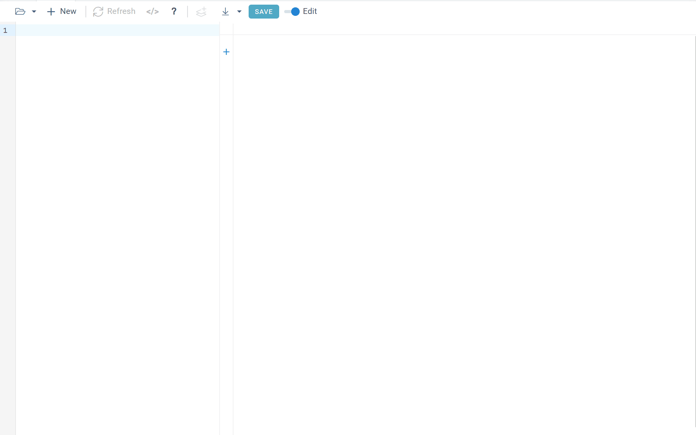

# Write the math, get the app: solving ODEs in the browser without code

*By Viktor Makarichev, Data Scientist at Datagrok, Inc.*

---

The math behind a two-compartment PK model is three ordinary differential equations (ODEs) and five parameters. Exposing it to users, however, is a different job entirely.

Someone has to choose and configure an ODE solver and build the plots. Parameters have to become inputs, with units, labels, and a decision about which ones users may change. Repeated dosing, saving and sharing runs, connecting the model to experimental data: each of these is more code. And when the model changes, all of that code has to be maintained.

The model, in other words, is often the small part of building a usable modeling application. The scaffolding around it is the work.

That work is unavoidable. ODE-based models are used throughout biopharma R&D: pharmacokinetics and pharmacodynamics, quantitative systems pharmacology, bioprocess modeling, and more. These models let scientists explore systems that are expensive or impossible to experiment on directly. A simulation is not a substitute for an experiment, but it can make the space of plausible decisions much easier to explore.

The usual way to put a model in front of people is to write it in R, Python, MATLAB, or another language, then build a notebook, dashboard, or web application around it. That is a perfectly reasonable approach, especially when the application needs highly customized behavior. The recurring problem is that every change goes through code: a parameter that was not exposed, a different output, a new UI control, a modification to the model itself.

What if the model could describe its own interface?

---

## The idea behind Diff Studio

That is the idea behind **Diff Studio**, part of the [Datagrok](https://datagrok.ai) platform.

Instead of writing the model as application code, you describe the math directly. Here is a fragment of a two-compartment pharmacokinetic model with first-order absorption:

```
#equations:
  dX/dt = -ka * X
  dY/dt =  ka * X - CL * Y / Vc - Q * (Y / Vc - Z / Vp)
  dZ/dt =  Q * (Y / Vc - Z / Vp)

#inits:
  X = 500
  Y = 0
  Z = 0

#parameters:
  ka = 1.0 {min: 0.1; max: 5}
  CL = 5.0 {units: L/h}
  Vc = 30  {caption: Central volume}
  Vp = 60  {caption: Peripheral volume}
  Q  = 3.0 {category: PK parameters}
```

A complete, runnable [PK model](https://public.datagrok.ai/apps/DiffStudio/Library/pk) is available in the Diff Studio library.

There is a lot of information here, but very little “software code”. The equations describe the system; the parameters describe what can vary; the annotations describe how those inputs should appear to a user.

Parameter annotations are not application code. They are part of the model description, but they give the platform enough information to generate the corresponding interface: a labeled input, a range, a unit, a slider. The point is not that this interface appears, but that nobody wrote it.

Paste the model into the Diff Studio editor, and it runs:



Diff Studio solves the equations, generates the interface, and updates the visualization when an input changes. A suitable solver is picked automatically, whether the system is stiff or not. Change clearance and the model is solved again. Change the dose and it is solved again. Change the volume or the absorption rate and the plots update. Multi-stage models, such as repeated dosing, are supported as well. The model remains a mathematical description rather than becoming another piece of custom software.

You are exploring the model rather than editing an application. You write the equations. The platform handles the machinery around them.

---

## The application layer becomes a platform capability

Once the model is represented separately from the surrounding application, functionality that would normally be implemented repeatedly can operate on the model itself.

Fitting is a good example. Suppose you have observed concentration data and want to find parameter values that reproduce them. In a conventional application, fitting can become another piece of model-specific plumbing: define the objective, connect it to the solver, select the parameters, constrain the search, and display the result.

In Diff Studio, fitting is an operation on the model. It is enough to load a CSV file with the observations, pick the parameters to vary, and the platform finds the values that best reproduce the data.


Sensitivity analysis works the same way. You can vary inputs and examine their influence on outputs using methods including Monte Carlo sampling and Sobol sensitivity indices.


The reusable object is the model, not the application: once you have it, simulation, fitting, sensitivity analysis, visualization, and sharing are just some of the things you can do with it.

---

## The model can also become a shared artifact

There is another problem with scientific models that has nothing to do with differential equations.

Models live in notebooks, scripts, project folders, shared drives, and elsewhere. Duplicates or slightly different versions appear across projects, and finding or maintaining the right model can become difficult.

Datagrok treats the model as something that lives in a shared environment. A model can be saved to the library, where it can be shared and reopened by other users; individual runs can be shared by URL; the model itself remains editable text and can be downloaded or exported to Markdown and LaTeX.

Collaboration around models is often just as important as running them. A scientist wants to send a colleague a specific parameterization, not just the equations. A model developer wants to publish the assumptions next to the model. A team wants one place for its PK, PK-PD, bioreactor, and kinetic models instead of a pile of scripts. None of this has to be reinvented for every model.


---

## From model to application

There is a useful middle ground between “no code” and “build everything from scratch.”

How much custom software should you have to build around the mathematics before another scientist can use the model? For many models, not much. A declarative model lets the platform take responsibility for the repetitive parts: interpreting the equations, generating inputs, solving the system, plotting the results, and exposing common analysis operations.

There is also a path from an interactive model to a custom application. A Diff Studio model can be exported as a JavaScript script that preserves its input annotations and becomes a regular platform function: it can be called from pipelines, other applications, or Python. The same model can then move into a larger workflow or a specialized application when more customization is needed.

So the progression does not have to be:

```
equation → rewrite as software → build application
```

It can be:

```
equation → interactive model → shared model → specialized application
```

A researcher starts by asking, “What happens if clearance is lower?”

Then, “Can we fit these observations?”

Then, “Can everyone on the project use the same model?”

Then, “Can we put it into our workflow?”

Those are different questions, but they all start with the same mathematical object.

---

## What's under the hood

Diff Studio is based on [Diff Grok](https://github.com/datagrok-ai/diff-grok), an open-source TypeScript library for initial value problems. It solves stiff and non-stiff systems in the browser, without a server round-trip. The numerical methods, the computational pipeline behind in-browser solving, and benchmarks against reference solvers are described in two papers:

- **Journal of Open Source Software (2026):** [Diff Studio: Ecosystem for Interactive Modeling by Ordinary Differential Equations](https://doi.org/10.21105/joss.09090) - about Diff Grok, the open-source engine.
- **Springer, CoMeSySo 2025 proceedings:** [Diff Studio: Web-Based Environment for Interactive Modeling with Ordinary Differential Equations](https://doi.org/10.1007/978-3-032-22236-7_31) - the original paper on the web-based approach and its performance on classic benchmarks.

---

## Try it

Developing a good model is hard and the science can take years, but the numerical methods for solving ODEs have been around for over a century. What gets rebuilt for every new model is the software around it: the interface, plots, fitting, analysis, sharing, and maintenance. That is the problem Diff Studio solves.

Try it:

-  **Run:** [Diff Studio on public.datagrok.ai](https://public.datagrok.ai/apps/DiffStudio) - free, nothing to install. Start from the [PK](https://public.datagrok.ai/apps/DiffStudio/Library/pk) model, or go through the [interactive tutorial](https://public.datagrok.ai/apps/tutorials/Tutorials/Scientificcomputing/Differentialequations).
- **Read:** the [documentation](https://datagrok.ai/help/compute/diff-studio) has the full syntax reference; the [community thread](https://community.datagrok.ai/t/solving-differential-equations/878) tracks new features as they land.

The model remains a model. The platform turns it into something people can use.

**Write the math. Get the app.**
