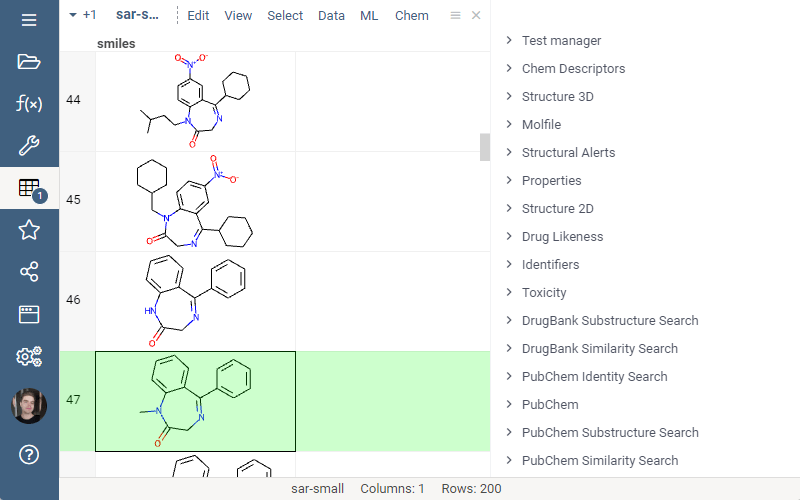

# DrugBank

DrugBank is a [package](https://datagrok.ai/help/develop/develop#packages) for the [Datagrok](https://datagrok.ai)
platform that provides search capabilities in [DrugBank](https://go.drugbank.com/) 
[Open Structures](https://go.drugbank.com/releases/latest#open-data) dataset.

## Features
- Substructure Search allows one to locate chemical structures that contain a particular connectivity and valence-bond 
(i.e., bond order) pattern.

- Similarity Search allows you to locate records that are similar to a chemical structure query using pre-specified 
similarity thresholds

See also:
* [Similarity Search](https://datagrok.ai/help/domains/chem/similarity-search)
* [Chem package](https://github.com/datagrok-ai/public/tree/master/packages/Chem)
