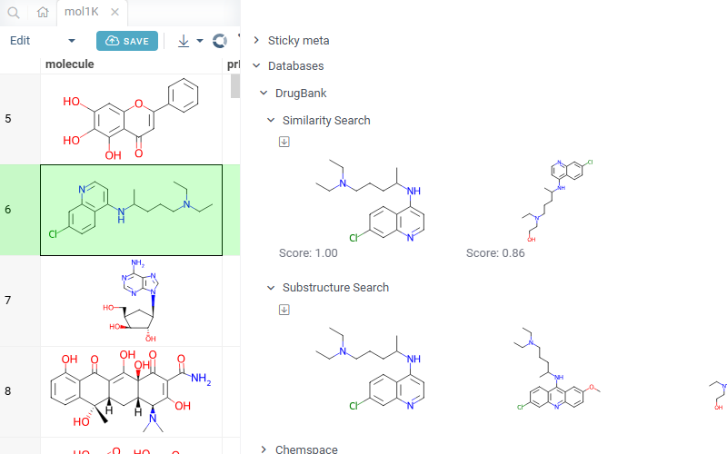
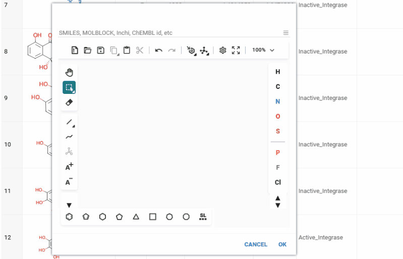

# DrugBank

DrugBank is a [package](https://datagrok.ai/help/develop/#packages) for the [Datagrok](https://datagrok.ai)
platform that provides search capabilities in [DrugBank](https://go.drugbank.com/)
[Open Structures](https://go.drugbank.com/releases/latest#open-data) dataset.

## Features

- Substructure Search finds DrugBank structures for the specified substructure

- Similarity Search finds similar DrugBank structures for the specified structure

- Drug name lookup: enter `db:<drug name>` in any Molecule input to resolve a drug
  name (or synonym) to its structure

See also:

- [Similarity and diversity Search](https://datagrok.ai/help/datagrok/solutions/domains/chem/#similarity-and-diversity-search)
- [Chem package](https://github.com/datagrok-ai/public/tree/master/packages/Chem)
