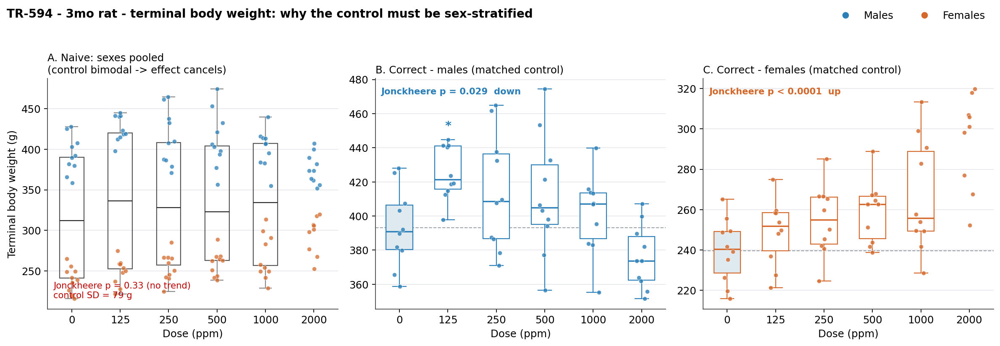
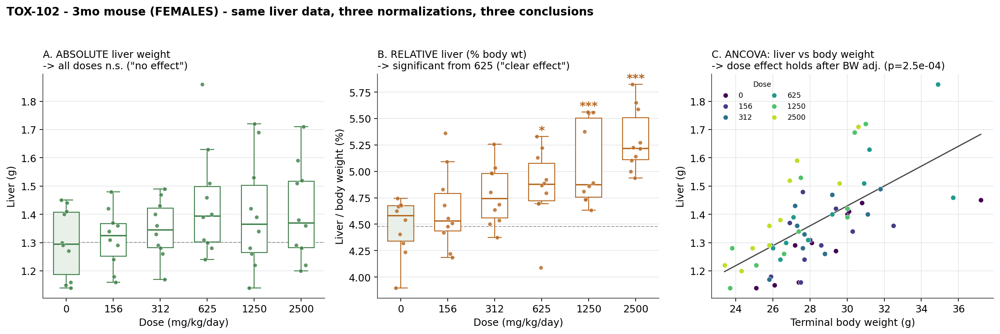
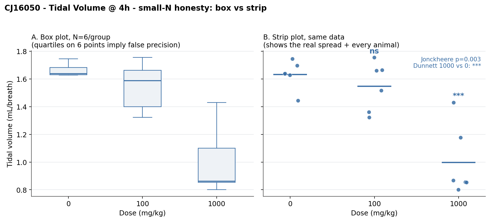

# Demo cases: comparison structure in box plots (preclinical toxicology)

Three short cases on real, open datasets showing that in a group comparison the **structure** (group → sex → matched control → normalization → display) matters more than the choice of statistical test. Each case lives in its own folder (`case-1`, `case-2`, `case-3`) with a cleaned CSV, a reproducible script, figures, and a detailed README.

---

## [Case 1 — Sex-stratified control](case-1/README.md)

**Data:** NTP TR-594, 3-month rat study, terminal body weight (6 doses × 2 sexes × N=10).
**Idea:** the control must be compared separately within each sex. Pooling sexes inflates the control variance (15→79 g), and the opposite male (↓) and female (↑) effects cancel — naive conclusion "no effect." Sex stratification recovers both real effects.
**Tables:** source — [Male Body Weight](https://cebs.niehs.nih.gov/cebs/get_file/accno/002-03160-0004-0000-6/file/1047201_Male_Individual_Animal_Body_Weight_Data.xls), [Female Body Weight](https://cebs.niehs.nih.gov/cebs/get_file/accno/002-03160-0004-0000-6/file/1047201_Female_Individual_Animal_Body_Weight_Data.xls); cleaned — [case-1/tr594_3mo_rat_terminal_bw.csv](case-1/tr594_3mo_rat_terminal_bw.csv)

---

## [Case 2 — Covariate adjustment of organ weight by body weight](case-2/README.md)

**Data:** NTP TOX-102, 3-month mouse study, liver weight + body weight (6 doses × 2 sexes × N=10).
**Idea:** organ weight cannot be compared as a raw mean. In females the same data yields three different conclusions: absolute weight — "no effect," relative weight — "clear effect," ANCOVA (body-weight adjusted) — the effect is real and not a body-weight artifact. The normalization choice changes the answer.
**Tables:** source — [Individual Animal Organ Weight Data](https://cebs.niehs.nih.gov/cebs/get_file/accno/002-02772-0009-0000-9/file/2032304_Individual_Animal_Organ_Weight_Data.xlsx); cleaned — [case-2/tox102_3mo_mouse_organ_weights.csv](case-2/tox102_3mo_mouse_organ_weights.csv)

---

## [Case 3 — Small N: box vs strip](case-3/README.md)

**Data:** PHUSE CJ16050 (SEND), respiratory function in rats, tidal volume (3 doses × N=6).
**Idea:** at small N (N=6) box-plot quartiles imply precision that is not there; a strip plot shows every animal and the real spread — including "non-responders" that the box hides.
**Tables:** source (SEND) — [dm.xpt](https://raw.githubusercontent.com/phuse-org/phuse-scripts/master/data/send/CJ16050/dm.xpt), [re.xpt](https://raw.githubusercontent.com/phuse-org/phuse-scripts/master/data/send/CJ16050/re.xpt); cleaned — [case-3/cj16050_resp_function.csv](case-3/cj16050_resp_function.csv)

---

*Data sources: NTP/CEBS (U.S. Government public domain), PHUSE phuse-scripts (MIT license). Details, source-file links, and the pipeline are in the README inside each folder.*
