# Flow

Flow is the visual workflow builder for the [Datagrok](https://datagrok.ai) platform. You build a data pipeline by
snapping ready-made steps together on a canvas — load data, transform it, compute new values, chart the results —
and Flow runs it for you, showing you the data at every step along the way. No code, no formulas to memorize,
nothing to install.

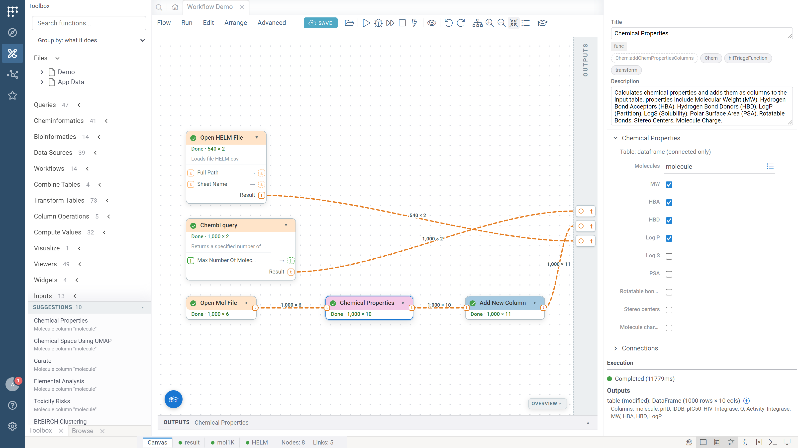

Everything you see above was assembled by pointing and clicking: files and functions were dragged in from the left,
connected with a few drags, and run with one click. The green checkmarks and the little "1,000 × 10" labels on the
wires tell you exactly what happened and how much data flowed through.

## Why Flow?

- **Anyone can build one.** If you can describe your process as "take this, do that to it, then that" — you can
  build it in Flow.
- **You see your data the whole time.** Every step shows its result the moment it finishes. No guessing whether
  something worked.
- **It's repeatable.** Run the same flow tomorrow, or on next month's data, and get the same process — not a
  one-off spreadsheet exercise.
- **It's shareable.** A saved flow becomes something colleagues can open, run, and even use as a single step
  inside their own flows. Results can be published as dashboards that always show fresh data.

## Your first flow

Open **Flow** from the Datagrok sidebar (or **Browse > Apps > Flow**). The start screen offers ready-made example
flows to explore, a blank canvas, and a guided tour:

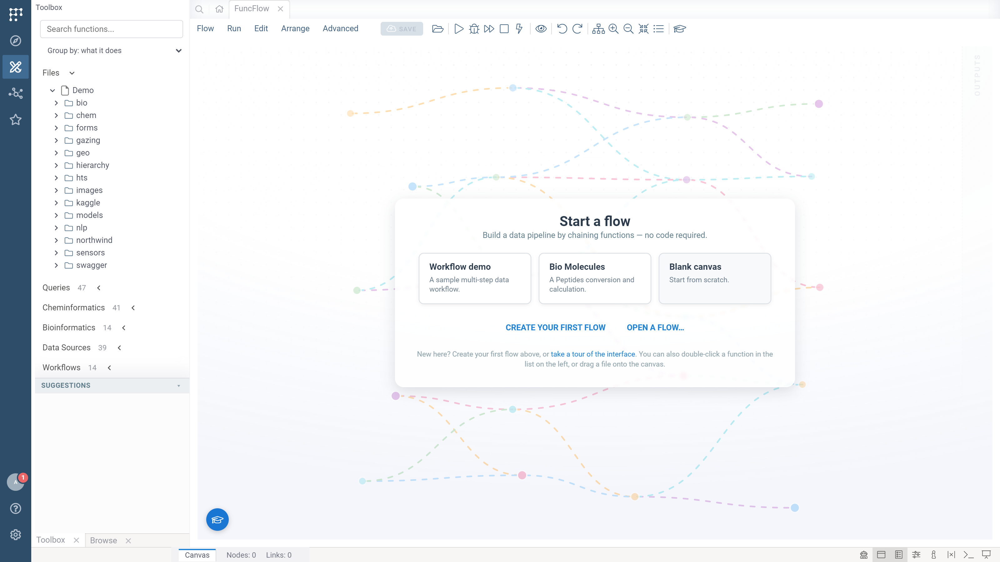

The fastest way to learn is to let Flow teach you. Click the graduation-cap button (bottom-left, always there) for
interactive tutorials and one-click answers to "How do I…?" questions:

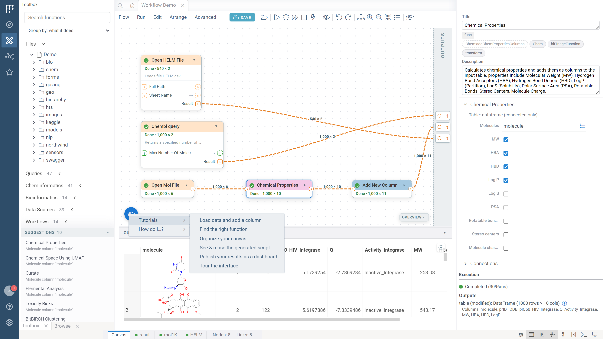

Tutorials don't just tell — they point at the exact button and wait for you to actually do each step:

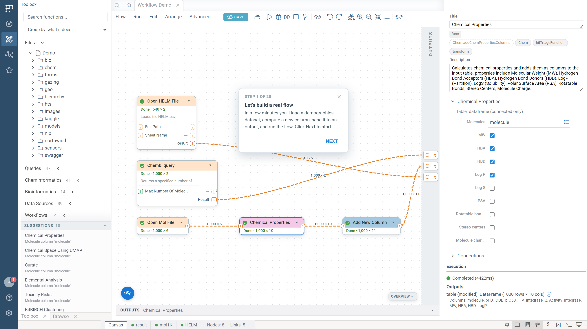

## Finding your building blocks

The **toolbox** on the left holds everything a flow can be made of: your files, database queries, hundreds of
functions from across the platform (statistics, chemistry, biology, text, machine learning…), and the flows you've
already saved. Type in the search box and the whole catalog filters as you type:

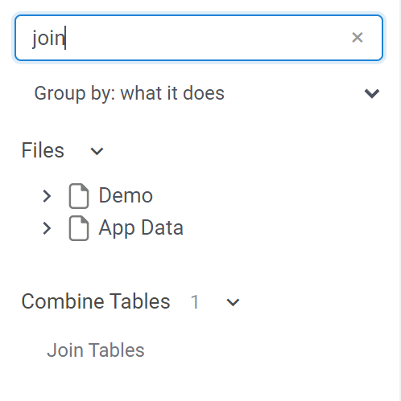

Prefer browsing? The **Group by** dropdown organizes functions by what they do — *Data Sources*, *Combine Tables*,
*Transform Tables*, *Compute Values*, *Visualize* — or by the package they come from.

Bringing data in is the same story: the **Files** pane shows your data connections, and double-clicking (or
dragging) a file drops a ready-to-go "Open File" step onto the canvas — no paths to type:

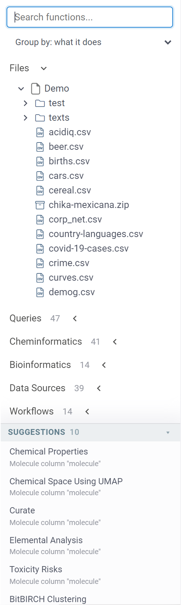

Flow also watches what you're working with and **suggests likely next steps**. Loaded a table of molecules? The
Suggestions pane offers chemistry steps that fit it, ready to drop in:

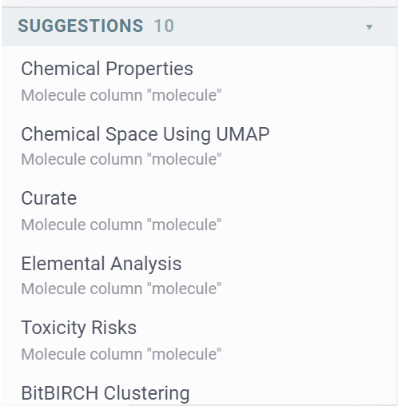

## Building the pipeline

Every step is a card on the canvas with **dots on its sides**: inputs on the left, outputs on the right. Drag from
one dot to another to connect steps — the dots are color-coded by what they carry (a table, a number, a piece of
text), and only compatible dots will connect, so you can't wire things up wrong. Dragging from an output into empty
space pops up a menu of compatible next steps, already connected when you pick one.

Click any step to adjust it in the **panel on the right** — plain input fields, checkboxes, and column pickers,
each explained with a tooltip. You can rename a step, read what it does, and see how it's connected:

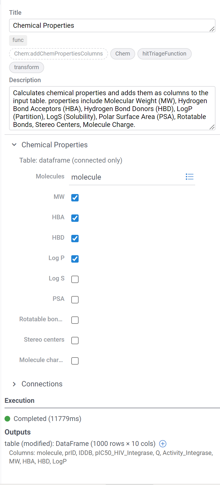

For steps with rich setup (like computing a new column), one click opens the function's own full dialog, seeded
with your real data — pick columns from live lists, preview the result, hit OK.

A few conveniences while you build: nodes snap into alignment as you drag them, **Tidy up layout** arranges the
whole flow left-to-right in one click, the **overview map** (bottom-right) lets you jump around large flows,
collapsing a node folds it down to its title, and undo/redo (Ctrl+Z) covers every single change.

## Run it and watch it work

Click **Run**. Steps light up as they execute — amber while working, green when done, red if something went wrong
— and each wire shows how much data passed through it:

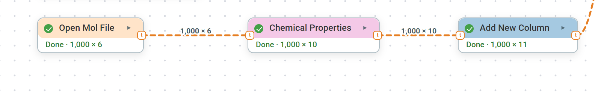

Click any finished step to see its actual result in the **output panel** at the bottom — tables appear as real,
scrollable grids (molecules and all), charts render live:

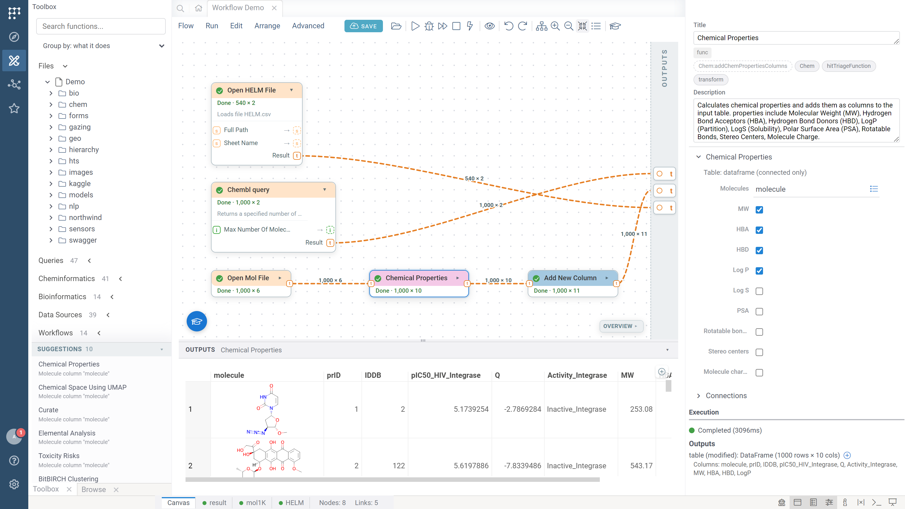

More ways to stay in control:

- **Preview any point mid-flow.** Right-click an output dot and choose *Run up to here & preview* — Flow runs just
  that slice and shows you the data. Great for checking your work as you go.
- **Autorun.** Toggle the ⚡ bolt and the flow re-runs itself after every change — and only the steps your change
  actually affected. Everything upstream keeps its result.
- **Out of date, not lost.** When you change something, affected steps are marked *Out of date* but keep showing
  their last result until the next run.
- **Rerun one step.** Right-click a step and rerun just it, feeding it the data captured by the last run — handy
  when one step of an expensive flow needs a tweak.
- **Pause where you want.** Drop a *Breakpoint* into the flow and run in Debug mode — execution pauses there until
  you press Continue.

## Explore results as full pages

Every table your flow produces gets its **own tab** next to *Canvas* in the bottom strip. The dot on the tab turns
green when the result is ready — amber means the flow changed and the table is from the previous run:

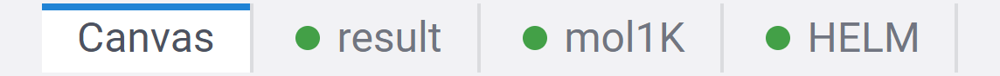

Click a tab and the result opens as a full Datagrok table page — add charts, filter, sort, color, rearrange
columns, exactly like any table in the platform:

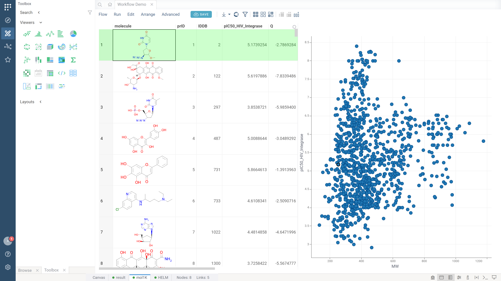

Whatever you arrange here is **remembered**: it's saved with the flow, comes back when you reopen it, and ships
with the dashboard when you publish one.

## No black box

Curious what your flow actually does? Click the 👁 eye icon: every flow is a transparent, readable recipe you can
inspect, copy, or hand to a developer — and what you see is exactly what runs:

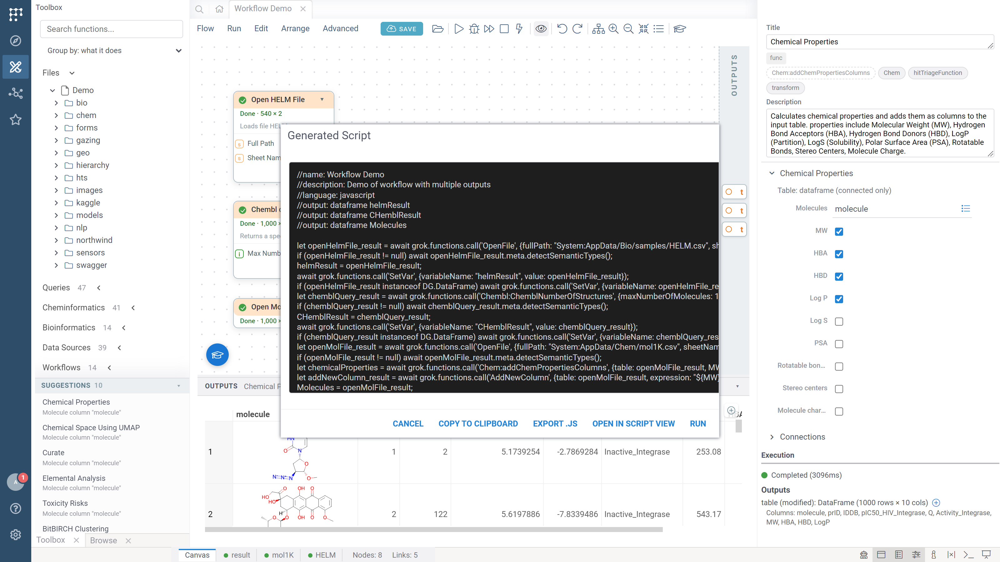

## Saving and sharing

Click **Save** to store your flow on the platform. Give it a name and a description, and optionally add it to a
space so your team can find it:

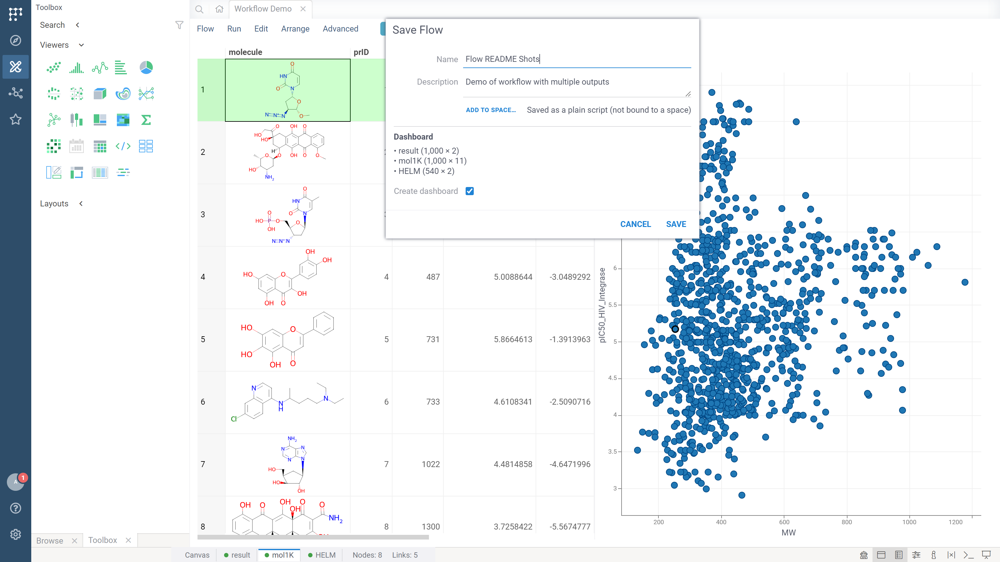

A saved flow can be reopened from anywhere, shared like any other Datagrok item, and — this is the fun part —
**used as a single step inside other flows**: saved flows appear in everyone's toolbox under *Workflows*. Build
your team's standard data-prep once, and everyone composes on top of it.

To pass a flow around as a file instead (email, chat), use **Flow → Export** — a colleague can import it on
their end and get the complete flow, layouts included.

## Publish a dashboard

Your flow's results can become a **dashboard** — a regular Datagrok project that colleagues open directly, without
ever seeing the canvas.

Run the flow, click **Save**, and the dialog's *Dashboard* section lists the tables it produced. Keep *Create
dashboard* checked and save — the platform's standard project dialog opens with everything pre-filled:

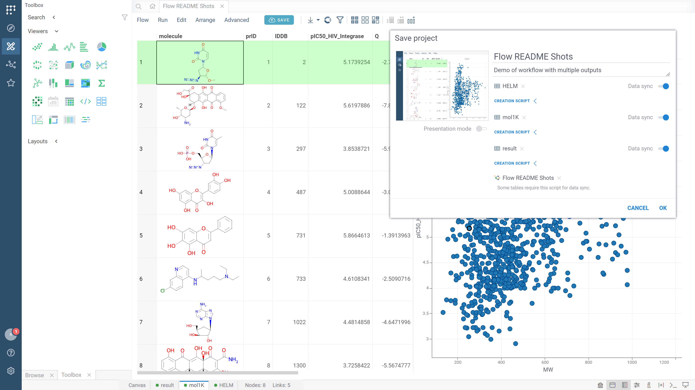

Notice the **Data sync** toggles: with sync on, the dashboard doesn't store a frozen copy of your data — it re-runs
your flow whenever someone opens it, so the dashboard always shows current data. (Flows that start from a manually
provided table publish as snapshots instead.)

And here's what a colleague sees when they open your dashboard — just the results, arranged the way you left them,
no canvas in sight:

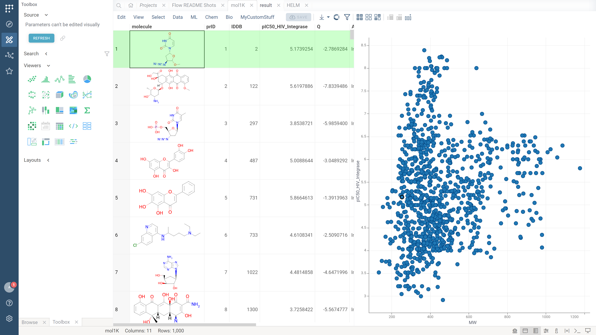

Publish again after improving the flow and the **same dashboard updates in place** — no duplicate projects
piling up. Want a separate copy? Use the *publish as new* link in the Save dialog.

## Where to learn more

The in-app tutorials cover everything above hands-on — including a start-to-finish
*Publish your results as a dashboard* walkthrough. Click the graduation cap in Flow anytime.

---

*For developers: build/publish instructions and architecture notes live in [CLAUDE.md](CLAUDE.md) and
[docs/](docs/). Flow is a standard [Datagrok package](https://datagrok.ai/help/develop/develop#packages).*
