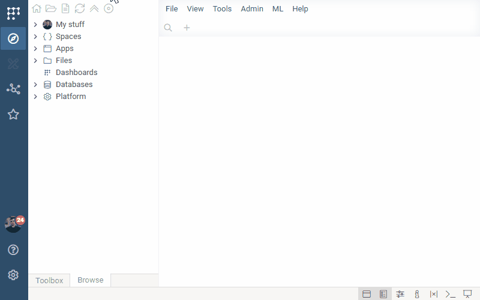

# GenomeBrowser

`GenomeBrowser` is a [package](https://datagrok.ai/help/develop/develop#packages) for the [Datagrok](https://datagrok.ai) platform that enables visualization of genomic data along with its annotations.

This viewer based on [@jbrowse/react-linear-genome-view](https://www.npmjs.com/package/@jbrowse/react-linear-genome-view) npm package.