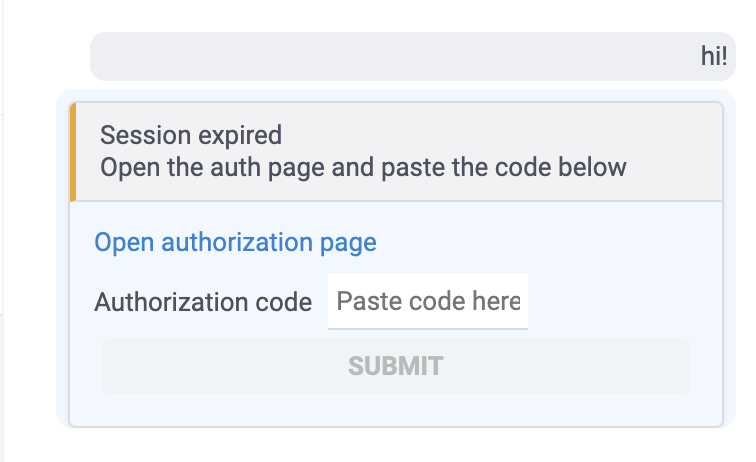
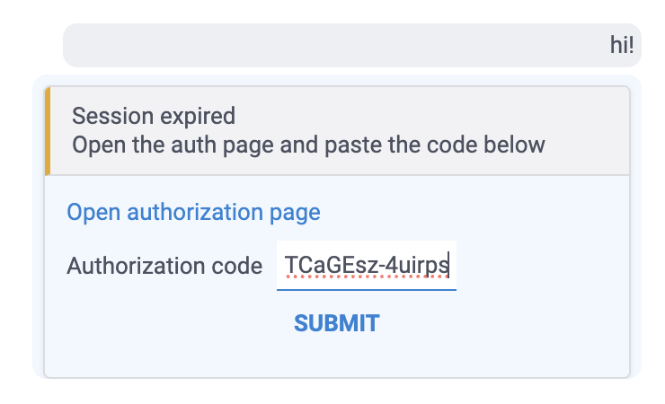
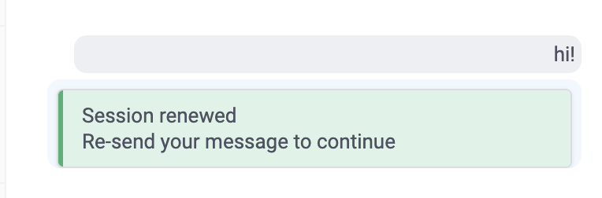

# Grokky

Grokky is the [AI for Datagrok](../../help/explore/ai/ai.md), enabling the following:
1. A generic AI JS API for core and other plugins to use LLMs
2. [Datagrok MCP server](dockerfiles/mcp-server/) so that Datagrok can be used by others
3. [Claude Code environment](dockerfiles/claude-runtime) for
   - writing scripts
   - doing agentic work on behalf of the user, augmented with custom skills
   and company-specific knowledge on processes, infrastruture, etc.
   - See [docs/CLAUDE_CODE_FLOW.md](docs/CLAUDE_CODE_FLOW.md) for a full description of the
     deployment, message protocol, and response-to-UI pipeline.
4. A general-purpose [AI console](...) to work with the platform
5. Supercharging your daily work:
   - Natural-language database queries
   - Automatic visualizations
   - Search across everything
   - Talk to your documents

Ideal for enterprises. You deploy Datagrok in your private cloud, and provide 
credentials for your enterprise Claude Code instance. Your data and tool usage
is safe, secure, governed, monitored and measured.

See also [Grokky GitHub issues](https://github.com/datagrok-ai/public/issues/3710). 

## Browser compatibility — the UI must run in Chrome 50 / Dartium

Grokky is regularly tested in **Dartium (≈ Chromium 50)**, so every UI change — Dart-side and this
plugin's TS/CSS — must work there. Verify before reporting UI work as done.

- **CSS**: no flexbox `gap` — use sibling margins (`.container > * + * { margin-…: … }`). No
  `scrollbar-gutter`. `filter` and `user-select` need `-webkit-` fallbacks (unprefixed = Chrome 53+/54+);
  `mask-image` needs `-webkit-mask-image`. CSS variables (`var(--…)`) and `calc()` are fine (Chrome 49+).
- **JS runtime APIs missing in Chrome 50** — avoid them, or rely on `src/polyfills.ts` (imported first
  from `package.ts` / `package-test.ts`). Already polyfilled: `crypto.randomUUID`,
  `Object.values`/`entries`/`fromEntries`, `String.prototype.trimStart`/`trimEnd`,
  `Array.prototype.flatMap`, `Element.prototype.append`/`prepend`/`replaceWith`. If you need another
  missing API, add it to `polyfills.ts` rather than to call sites.
- **Clipboard**: use `copyToClipboard()` from `src/utils.ts` — never `navigator.clipboard.writeText`
  directly (undefined in Chrome 50 and in insecure contexts).
- **Keyboard**: use `isEnterKey(e)` from `src/utils.ts` — `KeyboardEvent.key` is `undefined` in Chrome 50;
  use `e.keyCode` fallbacks for other keys too.
- **Syntax is fine**: the bundle targets `es6` (Chrome 50 supports ES2015), and newer syntax (`?.`, `??`,
  object spread, `async`/`await`) is transpiled by TypeScript. Only *runtime APIs* need attention.

## Source Structure

```
src/
├── package.ts              # Entry point — registers functions, init, search providers
├── polyfills.ts            # Chrome 50 / Dartium polyfills — imported first from package.ts / package-test.ts
├── utils.ts                # Shared utilities: viewer/dataframe descriptions, events, isEnterKey/copyToClipboard
├── ai/                     # AI panels, search, and UI wiring
│   ├── panel.ts            # AIPanel (singleton shell chat), DBAIPanel, ScriptingAIPanel, StreamingPanel
│   ├── ai-window.ts        # AIWindowManager — mounts panels into grok.shell.windows.ai, Ctrl+I toggle
│   ├── prompt-suggestions.ts # Curated prompt suggestions (files/suggestions.yaml), wand-icon menu
│   ├── ui.ts               # Setup functions that wire panels into the platform UI
│   ├── storage.ts          # ConversationStorage — IndexedDB persistence for chat history
│   ├── usage-limiter.ts    # Per-user daily request limits (group-configurable)
│   └── search/
│       ├── combined-search.ts   # Routes user queries to ranked aiSearchProvider functions
│       └── query-matching.ts    # LLM-based matching of natural-language to DB queries
├── claude/                 # Browser-facing Claude runtime integration
│   ├── runtime-client.ts   # WebSocket client to claude-runtime container
│   └── exec-blocks.ts      # Executes datagrok-exec / datagrok-entities fenced blocks
├── db/                     # Database tooling
│   ├── sql-tools.ts        # SQLGenerationContext — tool-call-based SQL generation
│   ├── db-index-tools.ts   # DBSchemaInfo caching, metadata generation
│   ├── query-meta-utils.ts # BuiltinDBInfoMeta — extends DG.DbInfo with built-in relations
│   └── indexes/            # Hardcoded schema indexes for known databases
│       ├── biologics-index.ts
│       └── chembl-index.ts
└── depr/                   # Deprecated code kept for reference (not imported by active code)
```

## Architecture

### AI Search Providers (`src/package.ts`)

Three `aiSearchProvider` functions are registered via decorators, each with a `useWhen` clause that
`CombinedAISearchAssistant` uses to route user queries:

- **Help** — documentation Q&A
- **Execute** — plans and executes JS code using structured output
- **Query** — matches natural-language to registered database queries

All three route through `ClaudeRuntimeClient` (Help uses plain `query()`, Execute and Query use `query()` with
a structured output schema).

### Combined Search (`src/ai/search/combined-search.ts`)

`CombinedAISearchAssistant` collects all `aiSearchProvider` functions, uses `ClaudeRuntimeClient.query()` to rank them
by relevance to the user query, then presents results in a lazy tab control.

### AI Panel (`src/ai/panel.ts`) — one singleton everywhere

The assistant is ONE `AIPanel` instance (created by `initAIWindow()`) with one Claude session,
used for every view — there are no per-view or specialized panels anymore. It survives view
switches — `AIWindowManager` (`src/ai/ai-window.ts`) never remounts on `onCurrentViewChanged`;
instead, every prompt gets a fresh workspace snapshot from `buildWorkspaceContext()` (current view
details, all open views, all workspace tables), and `datagrok-exec`/`datagrok_verify` blocks run
against the live `grok.shell.v`. The ribbon AI icons on table/script/query views just toggle this
singleton.

The panel streams through `ClaudeRuntimeClient` (`StreamingPanel` interface) with chat history,
streaming display, and conversation persistence via `ConversationStorage`.

### View AI tools (`src/ai/view-tools.ts`, `src/ai/view-tool-providers.ts`)

Views ship their own AI tools; the singleton collects them fresh on every prompt
(`collectViewAITools(grok.shell.v)`) from two sources:

1. **`view.getAITools()`** — js-api `ViewBase.getAITools(): AIViewTool[]` (`{name, description,
   inputSchema?, run}`). Dart views override `View.getAITools()` (e.g. `DataQueryView` returns
   `get_query_info` / `set_query_and_run`); for JS-defined views the Dart `JsViewHost` forwards the
   call to the original JS `ViewBase` instance (interop: `grok_View_GetAITools`). The collector also
   reads `view.jsView?.getAITools()` — js-api `View.jsView` (interop `grok_View_Get_JsView`) exposes
   the original JS `ViewBase` of a JS-hosted view (e.g. Flow's `FuncFlowView`, which ships
   graph-building tools: `list_flow_nodes`, `find_flow_node_types`, `add_flow_node`,
   `connect_flow_nodes`, `set_flow_node_inputs`, `select_flow_node`, `run_flow`).
2. **`viewAIToolsProvider` functions** — any package can register a function with
   `meta: {role: 'viewAIToolsProvider', viewType: '<view.type>'}` taking the view and returning
   `AIViewTool[]`. Grokky registers two: `queryViewAITools` (DataQueryView — SQL schema exploration +
   `get_sql_test_result` via `SQLGenerationContext`; discovers the connection through the view's
   native `get_query_info` tool) and `scriptViewAITools` (ScriptView — `get_script_code` /
   `set_script_code`).

Tool defs go to the runtime in the `user_message` as `clientTools`; the runtime exposes them via an
in-process `datagrok-view` MCP server whose calls round-trip to the browser as `input_request`,
where `streamOnce()` dispatches to the tool's `run`. Name read-only tools `list_*` / `get_*` —
other names count as actions and the runtime's verifier demands a `datagrok_verify` after them.

#### AI window visibility (sync with core)

`grok.shell.windows.showAI` (core, xamgle `ai_panel.dart`) is the single source of truth. Manual close
(X on the docked panel) resets core's `_aiDockNode` (handled in `docking.dart` `onClosing`) and the
value is persisted in core `Settings.showAI`, restored on startup. PowerPack's status-bar robot icon
and Grokky's `AIWindowManager` both read/write `showAI` and react to `onPanelVisibilityChanged`.

#### Shell AI Panel features

**`rawRender` mode** (terminal icon button): switches Claude response rendering from markdown to `<pre>`.
Only affects rendering — the Datagrok system prompt is still active unless `noPrompt` is also set.

**`!cmd`**: executes the shell command via bash without `DATAGROK_PROMPT`. The `!` prefix is stripped and
the message is sent with `systemPromptMode: 'bash'` (a minimal "output only stdout" system prompt defined in
`claude-runtime/src/prompts.ts`). Works in any mode, independent of `rawRender`.
`!!cmd` escapes to a literal `!cmd` prompt through the normal AI pipeline.

**`/noprompt`**: client-side slash command intercepted in `setupShellAIPanelUI()` before reaching Claude.
Calls `panel.enableNoPrompt()`: resets the session, clears output, enables `rawRender`, sets `_noPrompt = true`.
All subsequent messages in that session use `systemPromptMode: 'none'` (empty system prompt — pure Claude Code).

**System prompt is per-message, not per-session.** `buildOptions()` in `claude-runtime/src/query-options.ts` is called
fresh for every WebSocket message. The `resume` field carries conversation history only, so `systemPromptMode`
can vary per turn without restarting the session.

### AI UI Wiring (`src/ai/ui.ts`)

Setup functions called from `init()` that attach AI panels to platform UI elements:

- `setupSearchUI()` — wires `CombinedAISearchAssistant` into the global search bar
- `setupTableViewAIPanelUI()` — adds the AI ribbon icon to table views (toggles the singleton panel)
- `setupScriptsAIPanelUI()` — adds the AI icon to script views (toggles the singleton panel)
- `setupAIQueryEditorUI()` — called by the core query editor; just reports whether AI is configured
  (the query view's tools are collected at prompt time)
- `setupShellAIPanelUI()` — shows the singleton panel in the AI window
- `setupAgentScriptsUI()` — adds a Run button to file views under `MyFiles/agents/scripts/`

`runPromptWithLifecycle()` is the central routing function: intercepts `!`/`!!` prefixes,
skips `grok.ai.processPrompt()` when `rawRender` is on, and calls `runClaudeStreaming()`.

Also exports `askWiki()` and `smartExecution()`, which back the Help and Execute search providers respectively.

### Usage Limiter (`src/ai/usage-limiter.ts`)

`UsageLimiter` — singleton that enforces per-user daily AI request limits. Limits are group-configurable
(e.g., "AI Folks" group gets 1000/day, default is 20/day). Counts are persisted in `grok.userSettings`.

### Conversation Storage (`src/ai/storage.ts`)

`ConversationStorage` — IndexedDB-backed persistence for chat conversations. Stores up to 20 conversations
per context (connection ID, view, etc.), each with full message history and UI state.

### Claude Runtime Client (`src/claude/runtime-client.ts`)

Singleton WebSocket client. Discovers `claude-runtime` and `mcp-server` containers via `grok.dapi.docker`,
then exposes RxJS subjects for streaming events. API: `send()`, `abort()`, `respondToInput()`, and
promise-based `query()` for one-shot structured-output calls.

### Executable Blocks (`src/claude/exec-blocks.ts`)

Processes two types of fenced blocks in Claude responses:
- `` ```datagrok-exec `` — runs JS with `grok`/`ui`/`DG`/`view`/`t` globals
- `` ```datagrok-entities `` — renders interactive entity cards (files, scripts, queries, connections, projects, spaces)

The block formats (globals, JSON shapes, return-value rendering) are documented as Claude Code
skills under `dockerfiles/claude-runtime/plugin/skills/` and loaded into the runtime as a local
plugin. The inline system prompt only points Claude at these skills, keeping the prompt small.

Also provides `buildViewContext()` — serializes the current view (table columns, script code) for Claude prompts.

### SQL Tools (`src/db/sql-tools.ts`)

`SQLGenerationContext` — client-side natural-language-to-SQL generation against a connection's schema,
supporting multiple catalogs. Backs the `DBAIPanel` query-editor assistant.

### DB Index Tools (`src/db/db-index-tools.ts`)

`DBSchemaInfo` — caches database schema metadata (table/column info, foreign key references) per connection+schema.
Also provides `genDBConnectionMeta()` for generating and persisting LLM-friendly schema descriptions.

### Docker Containers (`dockerfiles/`)

- `claude-runtime/` — Hono + WebSocket server wrapping `@anthropic-ai/claude-agent-sdk`. Runs Claude sessions with a Datagrok-specific system prompt and resumable session support. Streams structured events to the browser: `chunk`, `tool_activity`, `final`, `error`, `aborted`, `queued`, `input_request`, `sync_status`, `auth_url` / `auth_done` / `auth_error`. The `src/` is split into `server.ts` (transport + `/ws` dispatch, auth subprocess, provider config, startup), `prompts.ts` (system prompts), `query-options.ts` (SDK query config + browser MCP tools + tool-activity summaries), and `session.ts` (session registry, streaming, turn queue, abort). Includes the skills & knowledge sync system (`src/sync/`, `src/user/`) — see [docs/IMPLEMENTATION.md](docs/IMPLEMENTATION.md) for the full spec. Ships a local Claude Code plugin (`plugin/`) with `datagrok-exec` and `datagrok-entities` skills describing the fenced-block formats; the plugin is attached for full-prompt sessions and skipped for `bash` / `none` modes.
- `mcp-server/` — MCP server (`@modelcontextprotocol/sdk`, HTTP transport) exposing Datagrok operations as tools: functions (list/get/call/create), files (list/download/upload), projects, spaces, and user info. Auth via per-request `x-user-api-key` / `x-datagrok-api-url` headers.

### Deprecated Code (`src/depr/`)

Contains the previous LLM abstraction layer (`LLMClient`, `ChatGptAssistant`, `PromptEngine`, etc.) and
earlier implementations of tableview tools, script tools, and AI panels. Kept for reference but not imported
by active code. All active AI features now route through `ClaudeRuntimeClient`.

## Key Singletons

- `ClaudeRuntimeClient.getInstance()` — WebSocket connection to Claude runtime
- `CombinedAISearchAssistant.instance` — AI search routing
- `UsageLimiter.getInstance()` — daily request limit enforcement

## Subscription authorization (UI)

On a Claude **subscription** (mounted `~/.claude/.credentials.json`, not an API key) the token
expires periodically. The panel renews it inline via a browser-relayed `claude auth login`: the user
opens the OAuth page, pastes the returned code, and clicks **Submit**; on success the strip turns
green and the message can be re-sent. Handlers `handleAuthStart` / `handleAuthCode` in
[`server.ts`](dockerfiles/claude-runtime/src/server.ts) drive the CLI; UI in
[`src/ai/ui.ts`](src/ai/ui.ts); `auth_*` messages in [CLAUDE_CODE_FLOW.md](docs/CLAUDE_CODE_FLOW.md).

| Session expired | Code pasted | Session renewed |
|---|---|---|
|  |  |  |

## Rebuilding the container images

`claude-runtime` and `mcp-server` code — `dockerfiles/*/src/`, the runtime `plugin/` skills and
`prompts.ts`, the Dockerfiles — compiles **inside** the image. `grok publish` / `npm run build`
rebuild only the browser bundle, not the images: rebuild the image (`docker build` in the container
dir) and redeploy after any change under `dockerfiles/`, or the container keeps serving old code.

## Configuration

All LLM requests go through `ClaudeRuntimeClient`, which connects via WebSocket to the `claude-runtime`
Docker container. The container handles Claude API authentication internally.