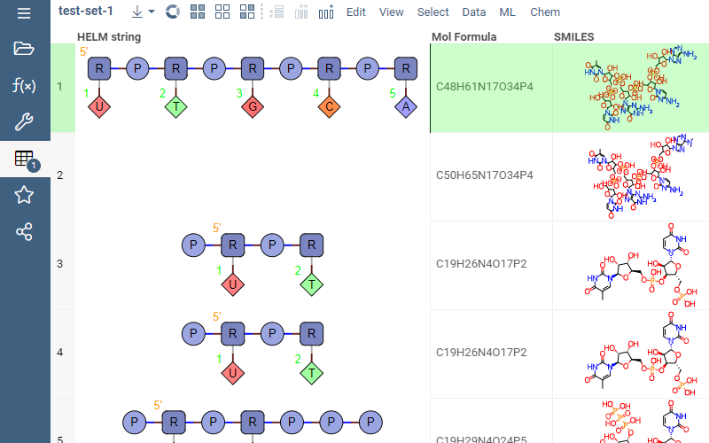

# HELM

Provides support for [HELM notation](https://pistoiaalliance.atlassian.net/wiki/spaces/HELM/overview)
(Hierarchical Editing Language for Macromolecules) -
a single notation that can encode the structure of complex biomolecules including diverse polymers,
non-natural monomers and complex attachment points.

[Andrew Skalkin](https://github.com/skalkin) |
[issue tracker](https://github.com/datagrok-ai/public/issues/700) | beta

## Features

* Automatic detection of HELM values in datasets
* Rendering in the spreadsheet
* Editing
* Conversion to SMARTS and MOLBLOCK
* Substructure search
* Similarity search
* Calculators (mol weight, mol formula, extinction coefficient, )
* Data augmentation (show relevant information in the context panel)

## Advanced features

* Integration with the [HELM2WebService](https://github.com/PistoiaHELM/HELM2WebService) (calculations, images, etc)
* Support for company-specific monomer libraries
* Management tool for monomer libraries (integrated with the security and privileges)
* Similarity and diversity analyses
* HELM space (UMAP or t-SNE based on the distance)
* Activity cliffs analysis (based on the HELM space)

Kudos to Pistoia alliance for open-sourcing the [HELM Web Editor](https://github.com/PistoiaHELM/HELMWebEditor)
that is used in this integration.

See also:

* [HELM overview](https://pistoiaalliance.atlassian.net/wiki/spaces/HELM/overview)
* [HELM Web Editor](https://github.com/PistoiaHELM/HELMWebEditor)
