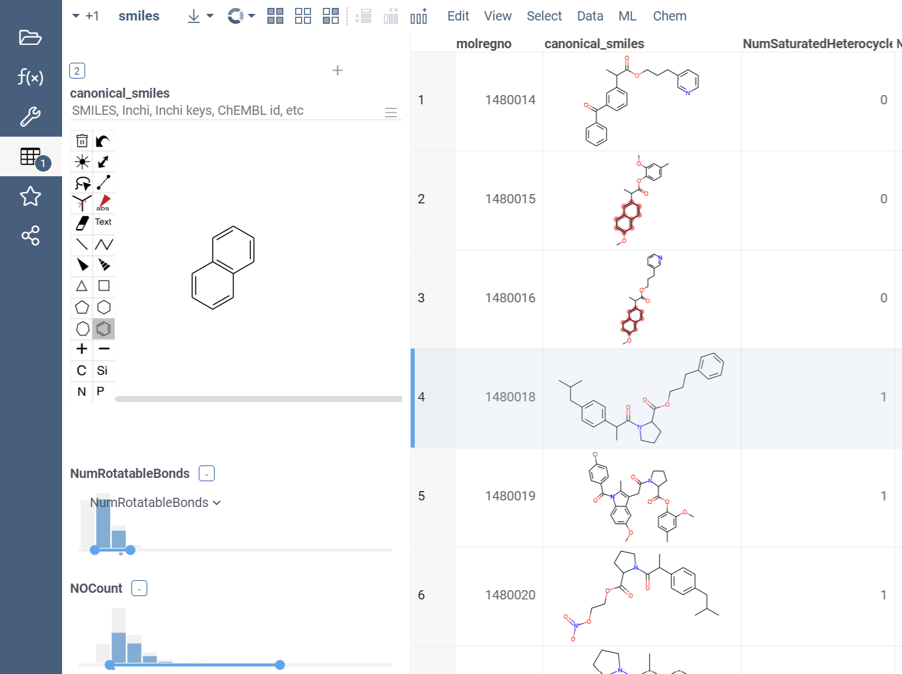

# HitDesign

HitDesign is a dynamic application designed for chemists and biologists to streamline the process of designing and selecting molecular hits. It facilitates collaboration by allowing users to sketch and add molecules, calculate molecular properties, filter based on these properties or substructure search, select hits, move hits to different stages, save campaigns, and share their work with others. The application is built around templates and campaigns, providing a structured yet flexible approach to hit design process.

## Templates

Templates in HitDesign contain essential configurations for conducting a campaign. template configuration includes:

- **Name** : Identifies the template.

- **Campaign Prefix** : A code used as a prefix for campaign names (e.g., TMP-1, TMP-2).

- **Additional fields** : Users can configure additional fields for the template, which will be prompted for input during campaign creation. These fields include name, type, and whether they are required or not. For example, additional field for a campaign can be a target protein name, Head scientist name, deadlile, etc.

- **Stages** : Users can define stages for the campaign. Tiles view provides a versatile way to organize molecules in the campaign. Users can drag and drop molecules between stages. For example, stages can be used to organize molecules by their readiness for synthesis.

- **Compute functions** : HitDesign aggregates compute functions tagged with `HitTriageFunction` from Datagrok packages. Users can select from these functions to perform calculations (e.g., mass, solubility, mutagenicity, partial charges, toxicity risks, etc.) on the dataset.
Every time user changes given molecule or adds new molecule to a dataframe, compute functions are executed automatically for that row.

- **Submit function** : Users can define custom submit functions (tagged with `HitTriageSubmitFunction`) to further process or save the filtered and computed dataset. This could include saving to a private database or additional calculations.

## Campaigns

Campaigns are built based on templates and encompass the actual hit design process.

- **Creation** : Select a template, fill out additional information and data source, and start the campaign.

- **Collaboration** : Campaigns are automatically shared. Users can copy and share URLs for seamless collaboration.

- **Functionality**: Once a campaign starts, you can add extra calculated columns, add new rows to dataframe and sketch molecules, apply changes, fileter, save or submit the campaign.

## Getting started

Users can continue ongoing campaigns either directly by a link or by selecting it from the campaigns table.

Users can create a new template by clicking on the `New Template` button in the `Templates` dropdown.

Users can start a new campaign by choosing a template and filling out the required information. 

After the campaign starts, users can sketch new molecules, filter, modify or add viewers to the campaign and then save them. once saved, reloading the campaign will restore the saved state.

Modifying or adding new molecules, will refresh the calculated columns.

Hit design campaign consists of two views, a main design view and a tiles view. You can access the tiles view from the views list. Tiles view provides a versatile way to organize molecules in the campaign. Users can drag and drop molecules between stages.

