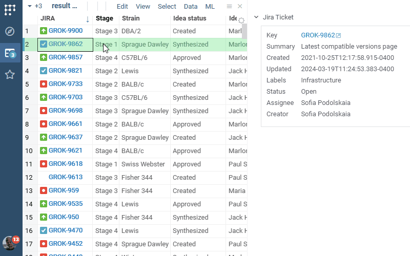
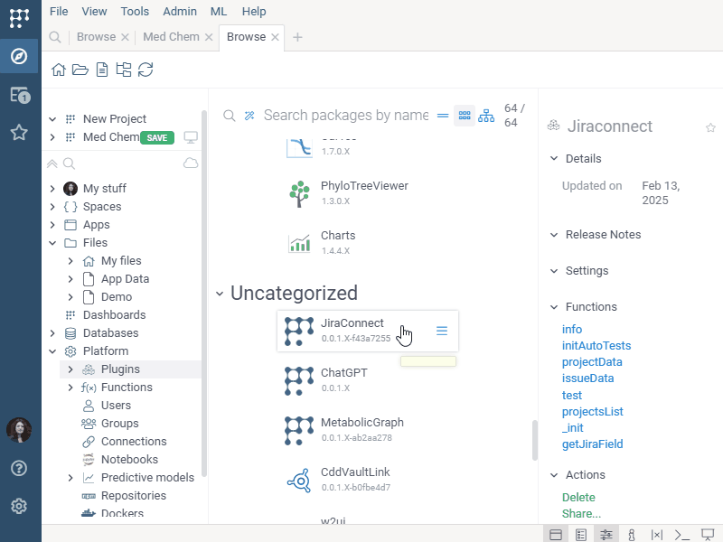

# Jira Connect

Jira Connect integrates JIRA with Datagrok. Connect to your JIRA project by providing credentials,
and the rest is handled automatically:

* Recognizing ticket identifiers everywhere
* Rich visual representation
* Showing ticket details in the context panel
* Rendering details in-cell, if there is enough space
* Ability to bring additional details as a column for the whole table

## Setting up 

Go to **Platform / Plugins / JiraConnect**, expand the Actions tab on the Context Panel, and click **Credentials**.. . In the dialog that opens, set the following:

- username 
- key
- host

Optionally, you can open this dialog by selecting **Credentials** from the JiraConnect package's context menu.

