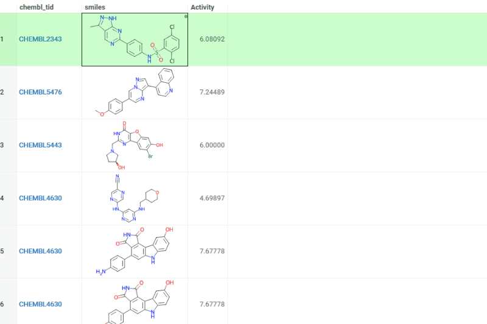

# Ketcher

Adds [Ketcher](https://lifescience.opensource.epam.com/ketcher/index.html), the open-source 2D
molecule editor by EPAM, as an optional molecular sketcher in the Datagrok platform. Once the
package is installed, "Ketcher" appears in every sketcher picker across the platform — grid cell
editor, dialog inputs, substructure filter, and so on.

## Usage

Pick **Ketcher** from the sketcher dropdown. The selection is
per-user and persisted via platform preferences.

