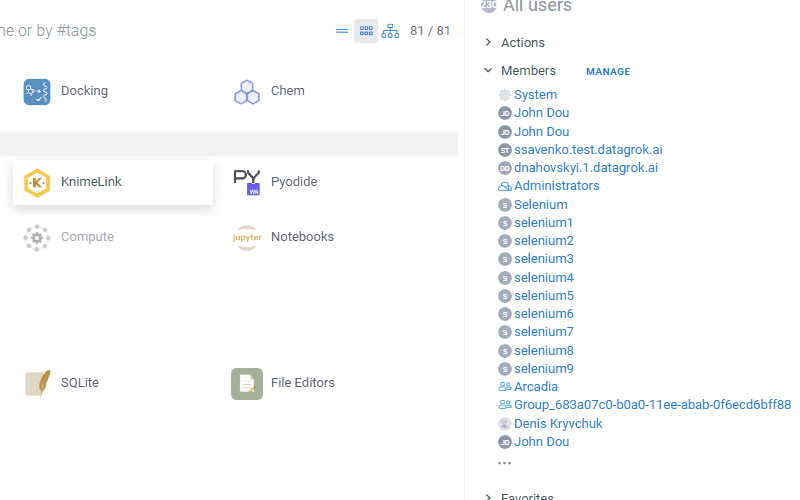
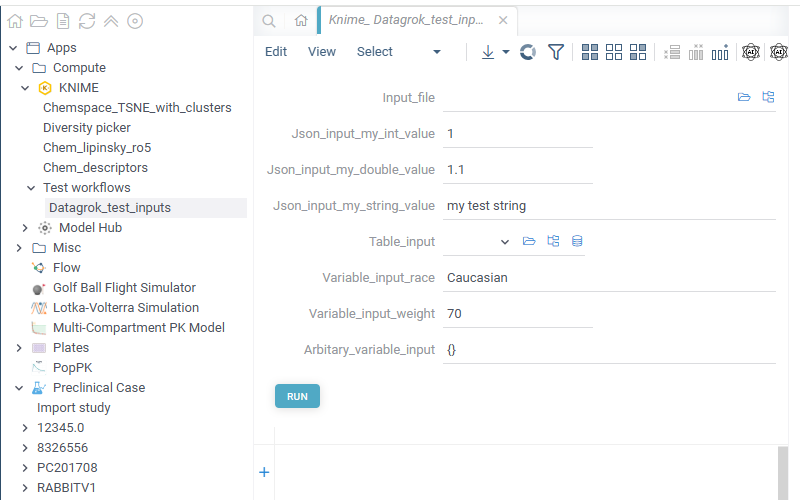
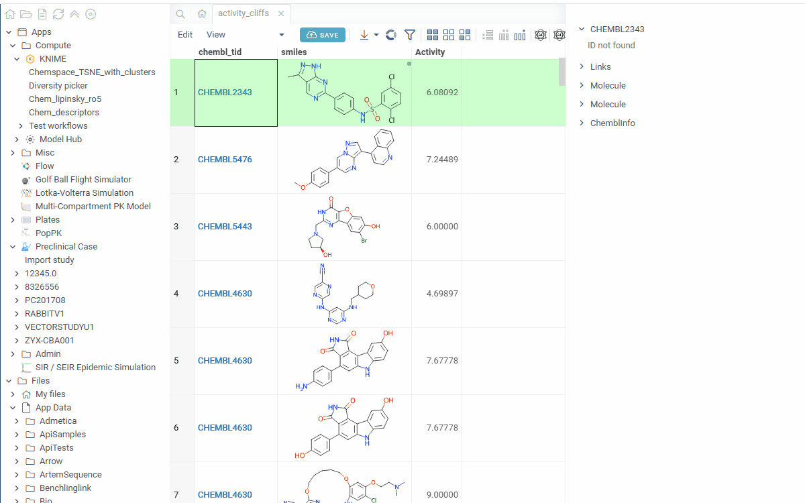

# KnimeLink

KnimeLink is a [Datagrok](https://datagrok.ai) package that integrates with
[KNIME Business Hub](https://www.knime.com/knime-business-hub), letting you browse deployments,
execute workflows, and visualize results — all without leaving Datagrok.


## Features

- Connect to KNIME Business Hub
- Browse and run REST deployments organized by team
- Pass tables, parameters, and files as workflow input
- View execution results as Datagrok DataFrames
- Auto-register KNIME workflows as Datagrok functions (available in search, pipelines, etc.)

## Setup

### 1. Configure the connection

Go to **Manage > Plugins > KnimeLink** and fill in the settings:

| Setting             | Default                  | Description                               |
|---------------------|--------------------------|-------------------------------------------|
| `baseUrl`           | `https://hub.knime.com`  | KNIME Hub URL (the `api.` prefix is auto-derived) |
| `timeoutMinutes`    | `10`                     | Max wait time for async job completion    |
| `pollingIntervalMs` | `3000`                   | Polling interval for job status checks    |


### 2. Set up credentials

In the same settings panel, open **Credentials** and provide:

- **appPasswordId** — your Application Password ID
- **appPasswordValue** — the generated token



## Usage

### Browsing deployments

Open the app from **Browse > Compute > KNIME**. The sidebar tree shows all deployments
grouped by team.

### Executing a workflow

Select a deployment from the tree. An input form is generated automatically from the
workflow's OpenAPI spec, with parameter types, defaults, and descriptions pre-populated.



Fill in the inputs and click **Execute**. Supported input types:

- **Tables** — select a Datagrok DataFrame
- **Parameters** — string, number, boolean fields with defaults from the spec (generated for JSON inputs with pre-defined fields or templated variables)
- **Files** — file upload inputs (sent as multipart/form-data)
- **Variables** — pass flow variables or JSON inputs as JSON via the dedicated text area

Results of **REST services** are displayed as Datagrok DataFrames;



### Auto-registered functions

On startup, KnimeLink registers each KNIME deployment as a Datagrok function
(prefixed with `Knime_`). These functions are:

- Discoverable via the platform search bar
- Usable in Datagrok pipelines and scripts
- Callable programmatically:

```typescript
await grok.functions.call('Knime_My_Workflow', {input_table: df, threshold: '0.5'});
```

Functions are cached in user settings for instant availability on subsequent startups,
with a background refresh to pick up changes from the Hub.

## See also

- [KNIME Business Hub documentation](https://docs.knime.com/latest/business_hub_user_guide/)
- [Datagrok documentation](https://datagrok.ai/help/)
- [Datagrok Compute](https://datagrok.ai/help/compute/)
