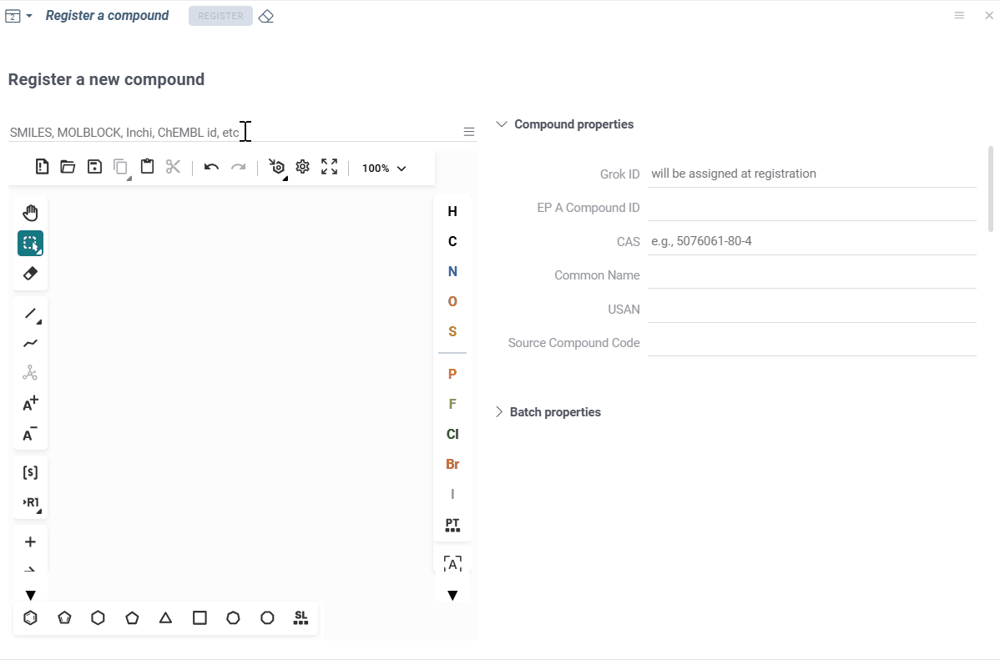
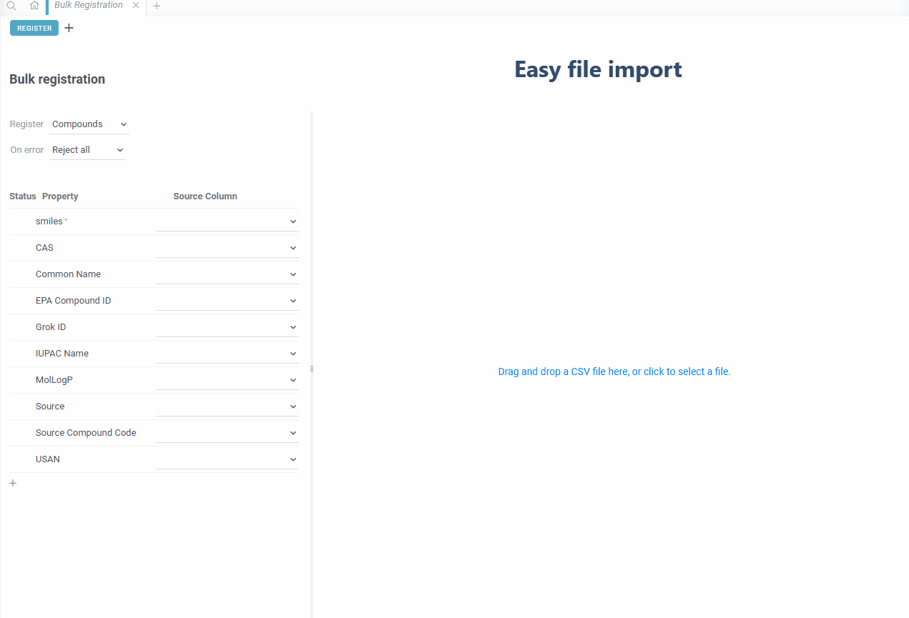
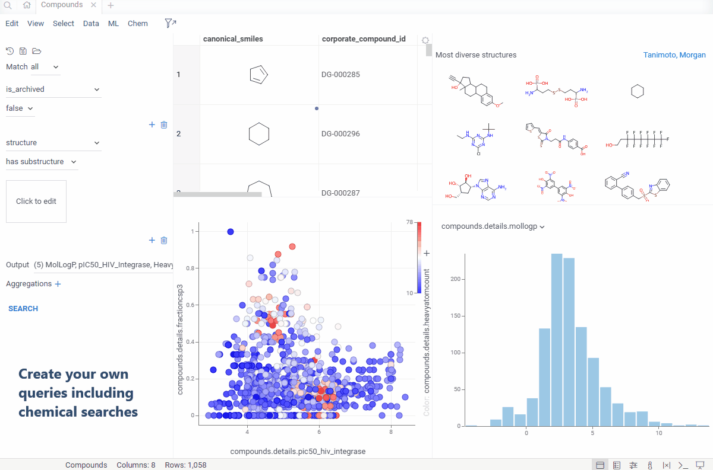

# MolTrack

The MolTrack [package](https://datagrok.ai/help/develop/develop#packages) integrates [mol-track](https://github.com/datagrok-ai/mol-track), an open-source system for managing chemical compounds, batches, and assay data. This package allows researchers to register and track chemical information efficiently.

With this package you can:

* Register individual compounds and batches.

* Perform bulk registration of compounds, batches, and assay data.

* Perform structure-based search.

