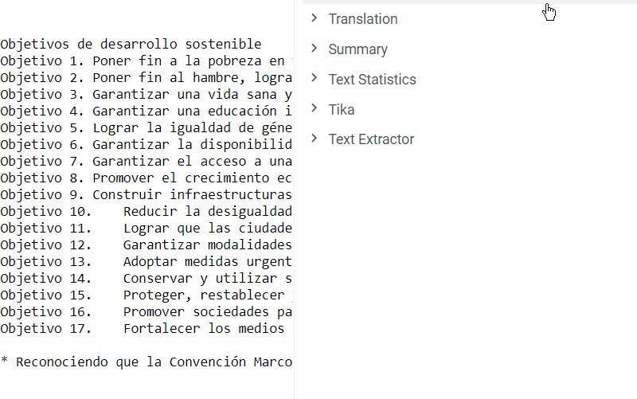

*NLP* is a [Datagrok package](https://datagrok.ai/help/develop/develop#packages) for natural language processing. The package provides integration with [AWS Translate](https://aws.amazon.com/translate/), a neural machine translation service, and extends Datagrok with [info panels](https://datagrok.ai/help/discover/info-panels) for text files.

*Natural Language Processing*, or *NLP* for short, is a branch of artificial intelligence that builds a bridge between computers and human languages. This field has many applications, including:

  * [language identification](https://en.wikipedia.org/wiki/Language_identification)
  * [machine translation](https://en.wikipedia.org/wiki/Machine_translation)
  * [sentiment analysis](https://en.wikipedia.org/wiki/Sentiment_analysis)
  * [text summarization](https://en.wikipedia.org/wiki/Automatic_summarization)
  * [topic modeling](https://en.wikipedia.org/wiki/Topic_model)
  * [entity extraction](https://en.wikipedia.org/wiki/Named-entity_recognition)

## Text Extraction

It all starts with extracting text. This is a building block for other, more
complex tasks. Due to the high demand, it is essential to support as many
popular text file formats as possible. The platform comes with a built-in
[file browser](https://datagrok.ai/help/access/file-browser-and-file-shares)
for easy file management. The package extends it by processing text from
`pdf`, `doc`, `docx`, `odt`, and other text formats.


## Language Identification

Determining the language of a document is an important preprocessing step for
many language-related tasks. Automatic language detection may be part of
applications that perform machine translation or semantic analysis. Datagrok's
language identification is powered by Google's [Compact Language Detector v3 (CLD3)](https://github.com/google/cld3) and supports over [100 languages](https://github.com/google/cld3#supported-languages).
As with text extraction, this functionality is used in the [Translation](#neural-machine-translation) info panel.

## Neural Machine Translation

To translate a text, navigate to the file browser and select one of the demo files (see the `texts` folder). Alternatively, open your personal folder and drag-and-drop your file to the platform. Now, whenever you click
on the file, you will see a suggestion to translate it in the property panel on the right.



The language is identified automatically, but you always have a chance to change it manually.
The default target language is English, so be sure to choose another option if the original text is in English.

## Developer Notes

The package demonstrates two ways of developing [info panels](https://datagrok.ai/help/discover/info-panels) for Datagrok: with panel scripts and with JavaScript panel functions.

To write a panel script in any of the [languages supported by the platform](https://datagrok.ai/help/develop/scripting#supported-languages), you should indicate the `panel` tag and specify conditions for the panel to be shown (in the `condition` [header parameter](https://datagrok.ai/help/develop/scripting#header-parameters)):

```python
#name: Language Detection
#language: python
#input: file file {semType: text} [A text to analyze]
#output: string language {semType: lang} [Detected language]
#tags: nlp, panel
#condition: file.isFile && file.size < 1e6 && supportedExt(file.name)
```

The [scripts](https://github.com/datagrok-ai/public/tree/master/packages/NLP/scripts) folder contains more examples of such panel scripts, which are written in Python and work specifically on text files.

A different approach is used to add an info panel from a JavaScript file. The panel function should be properly annotated to return a widget. A simplified example is shown below:

```javascript
//name: Translation
//tags: panel, widgets
//input: file textfile
//output: widget result
//condition: isTextFile(textfile)
export function translationPanel(textfile) {
    return new DG.Widget(ui.divText("Lost in Translation"));
}
```

Refer to [src/package.js](https://github.com/datagrok-ai/public/blob/master/packages/NLP/src/package.js) to see the panel's complete code.

See also:

  * [Natural Language Processing](https://en.wikipedia.org/wiki/Natural_language_processing)
  * [Scripting](https://datagrok.ai/help/develop/scripting)
  * [Info Panels](https://datagrok.ai/help/discover/info-panels)
