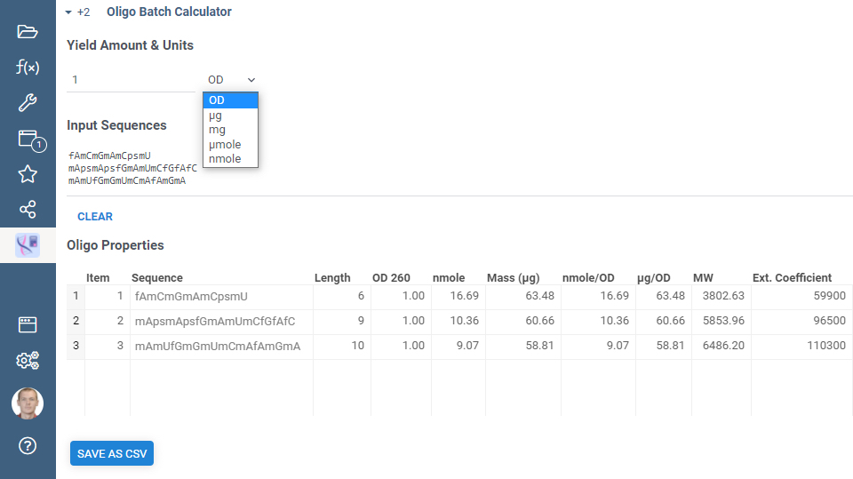

# [Oligo Batch Calculator](https://public.datagrok.ai/apps/Oligobatchcalculator/)

**Calculates the following oligonucleotide properties:**

1. Length
2. Optical Density
3. NMoles
4. Mass
5. Molecular Weight
6. Extinction Coefficient (using nearest neighbour method)

**To calculate these properties:**

1. Paste your sequences into input text field
2. Specify amount and units
3. Click "SAVE AS CSV" to export calculations.

If some symbols in sequences are not recognized, they are painted red. Either correct
the mistakes manually, or press "REMOVE ERRORS" to remove the unrecognized symbols.

All supported sequence representations are listed [here](https://github.com/datagrok-ai/public/tree/master/packages/SequenceTranslator#sequence-representations).

The functionality of this application was inspired by [Oligo Properties Calculator](https://www.biosyn.com/Oligo-Calculator.aspx)

See also:
* [YouTube video](https://www.youtube.com/watch?v=2xuxJjpjXi4&t=4908s).
