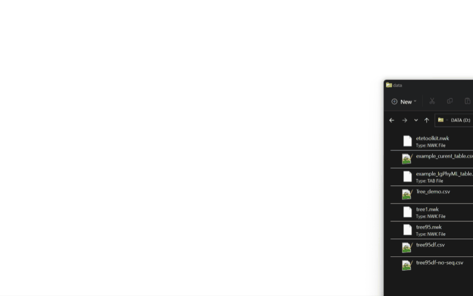

# PhyloTreeViewer

*PhyloTreeViewer* is a [Datagrok package](https://datagrok.ai/help/develop/develop#packages) for phylogenetic trees
visualization.

# Notations

Now only the _Newick_ tree format is supported.

# Viewers

[PhylocanvasGL viewer](./src/phylocanvas-gl-viewer.ts) is a [JsViewer](../../js-api/src/viewer.ts) wrapper
of PhylocanvasGL javascript library component to use within Datagrok. It exposes the most of [the properties
of the Phylocanvas.gl](https://www.phylocanvas.gl/docs/properties.html).



The viewer expects dataFrame with the tag '.newick'

```
const df: DG.DataFrame = ...;
df.setTag('.');
const treeViewer = df.plot.fromType('PhyloTreeViewer:PhylocanvasGl', {});
```

# File handlers
File with .nwk, .newick extension will be transformed to a DataFrame of nodes (node, parent, leaf columns)
with PhylocanvasGlViewer docked on the right side of the grid.
