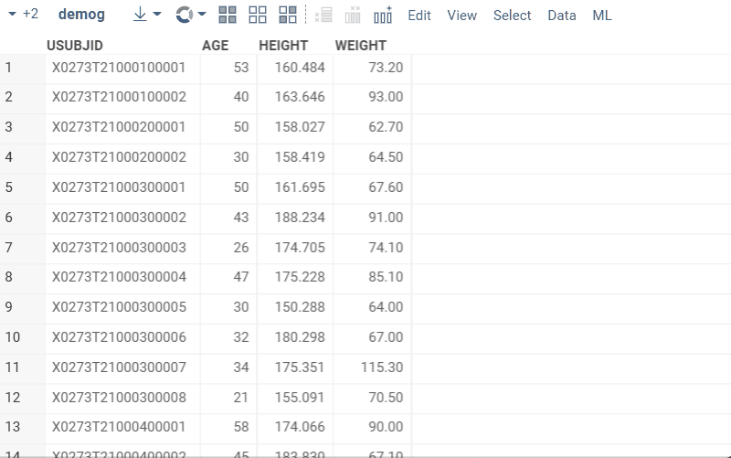
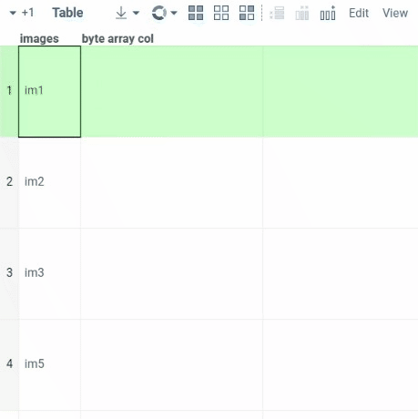
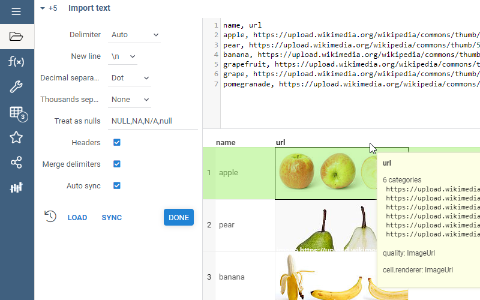
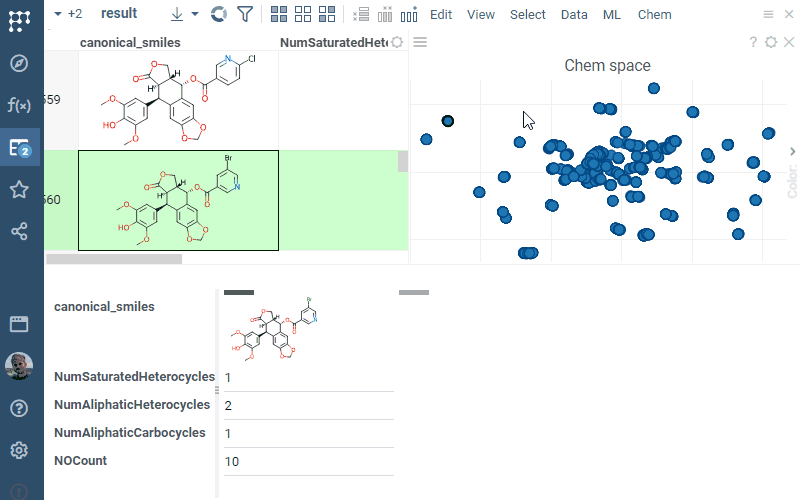

# PowerGrid

PowerGrid contains popular spreadsheet extensions, such as [sparklines](#sparklines) and support for [images](#images).

## Sparklines

Sparklines are very small charts, typically without axes or coordinates. The main goal of a sparkline is to provide a
graphical representation of data row that to get an impression of the object as a whole, and to
instantly compare objects with each other. To form a representation, any quantitative features of objects can
be used, which are displayed as the position or size of a graphical element. Datagrok has a few ready-to-use sparkline
chart types: `sparklines`, `bar chart`, `pie chart` and `radar chart`.

To add a sparkline column, open `Add | Summary Columns | ...` from the grid's popup menu.

To customize a sparkline column, click on its header and expand the `Renderer` pane in the context panel.



## Images

Datagrok supports two types of images in cells: embedded and linked.

### Embedded images

To programmatically add an image column to the dataframe, use the following
code:  ```dataFrame.columns.addNewBytes('my image')```.

To add an image, double-click on the cell and choose the file. Supported extensions are `.jpg`, `.png`, and `.jpeg`.



### Linked images

Datagrok automatically detects and visualizes images from URLs (starting with "http://" or "https://" and ending with a
supported image extension) as well as images stored as Datagrok paths (beginning with "System:" and ending with a
supported image extension). If the image is not automatically detected, click on the column, press `F2` to open the
column properties, and set the following:

* `quality` to `ImageUrl`
* `cell.renderer` to `ImageUrl`.

The images might not occur instantaneously. If this happens, clone the layout (Layout | Clone).
We are working to get that fixed.



### Forms viewer

**Forms viewer** shows rows in forms positioned side-by-side.
It is useful for quick exploration of the selection, as well as for comparison between current,
mouse-over, and selected rows.

To change which fields are shown, use the **Fields** property in the options.
Drag-and-drop columns to reorder. Choose which rows to show by setting the
following properties: `Show Current Row`, `Show Mouse Over Row`, and `Show Selected Rows`.
Green color stripe on top of the form indicates current row, grey one indicates mouse-over row.

The viewer also works together with the grid:
* To select or deselect rows, Ctrl+click the form.
* To go to a particular cell in a grid, click on a field
* To make a column current, click on the column name.



See also:

* [Viewers](https://datagrok.ai/help/visualize/viewers)
* [Develop custom cell renderers](https://datagrok.ai/help/develop/how-to/custom-cell-renderers)
* [Packages](https://datagrok.ai/help/develop/#packages)
