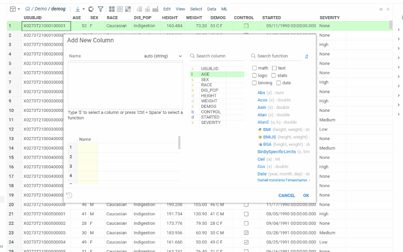
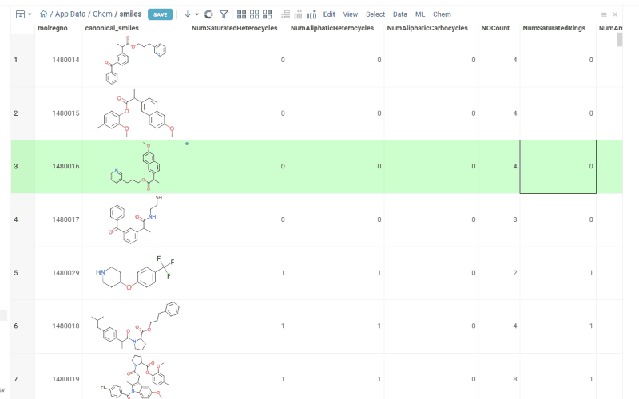

# Power Pack

Commonly used platform enhancements

Owner: [Andrew Skalkin](https://github.com/skalkin) 
Issues: [Tracker](https://github.com/datagrok-ai/public/projects/2)

## Power widgets

A start page that contains widgets (annotated with the `dashboard` tag) that are dynamically
discovered from the packages available to the current user.

## Power search

Ability to search for anything from the start screen, with the special support for the following:

* Widgets
* Functions
* Applications
* User-defined external apps (via iframe)
* Entities (connections, queries, etc)

### Search templates

The goal is to provide an efficient and extensible way to react to user input
in the global search box. A search template consists of the following:

* regular expressions (parameters would become properties)
* widget identifier
* property mapping

A collection of search templates is curated by the community (either global or
within your organization). You can mix and match template collections by editing
the `searchTemplatePaths` package property.

The following example illustrates the template that binds a ChEMBL molecule identifier
(such as CHEMBL123456) with a web page containing the molecule summary. Here is the
corresponding entry in the chembl.json file:

```
     {
      "id": "chembl-id-representations",
      "name": "Representations",
      "widget": "webWidget",
      "templates": [{
        "template": "(CHEMBL[0-9]+)",
        "url": "https://www.ebi.ac.uk/chembl/embed/#compound_report_card/${1}/representations"
      }]
    }
```

Now, when you enter `CHEMBL123456` in the search box, the following page appears:
`https://www.ebi.ac.uk/chembl/embed/#compound_report_card/CHEMBL123456/representations`

## Power Expressions

`Add New Column` dialog that lets you add derived columns by applying a formula to existing columns.
To activate, click on the `Add New Column` icon on the toolbar or go to top menu `Edit` -> `Add New Column`. Key features are:

* Support for functions implemented with Python, R, Julia, JavaScript, C++, and others. To add function to an editor, type it manually, drag and drop from
functions registry on the right or use *plus* icon. You can combine functions written in different languages in one formula.

* Auto-suggested functions based on the column type and semantic type. To use:
  * set functions sorting type in function registry to 'By relevance'
  * select column of interest
  * the functions in functions registry are sorted automatically. More relevant functions are on top of the list.
  * drag and drop function to the editor field or click *plus* icon. Corresponding parameter is prefilled automatically with selected column.

* Interactive preview of results as you type
* Autocompletion for functions (including packages names) and columns. Suggestions appear as you type.
* Different highlights within formula for better readability. For instance, column names are highlighted with in bold blue font.
* Validation against various types of mistakes including syntax errors, missing columns detection, incorrect data types, unmatching brackets.
* Resulting column type autodetection
* Fast function and column search
* History, saving and reusing formulas

# Windows Manager

Use icons on the right of the status bar to control visibility of tool windows.