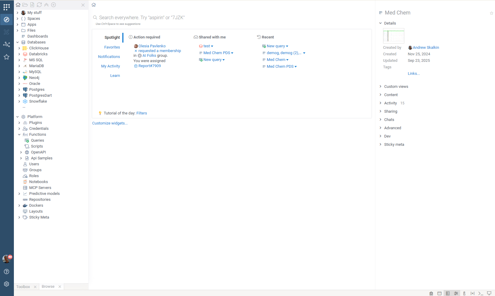

# Initial user experience

We want to be able to customize initial end-user experience for non-expert users (also these who only occasionally).
For that, we have developed the "Spotlight" widget that shows the stuff presumingly most relevant to the
user:
- **Spotlight**: a dynamic, most important first panel with a mix of the following
  - **Action required**: requests for you (such as request to accept user to a group)
  - **Notifications**: notifications you have not seen yet
  - **Shared with me**: stuff recently shared with you
  - **Recent**: stuff you have recently interacted with
- **Favorites**: objects you have marked as favorites
- **Notifications**: all notifications
- **My activity**: all activity
- **Learn**: self-learning: video, wiki, demo, tutorials.

In addition to the "Spotlight" widget, there are other widgets (marked as such in plugins) that you 
can turn on or off by clicking "Customize widgets..."

This is how it looks currently.

However, it would be great to have even more streamlined experience for non-expert users, or users who
have a well-defined workflow. For instance, if 90% of their work starts with getting data -> we should
make it the most prominent option. Fortunately, we already have all the primitives (such as queries, 
functions, etc) for that. One way to do it would be for power users or admins to "push" entities
(such as projects, or queries) to the first screen - either in the "Spotlight" tab, or even 
in another top-level tab that would be active by default.

## Workspace

Workspace is the first tab in the "Spotlight" widget. It shows entities "pinned" to groups a user belongs to
(via the favorites mechanism). Group admin can pin it there.

### Pinning entities to workspace

Two ways to pin an entity:
- Right-click on it, and under the "Group favorites" submenu check the corresponding groups
- Drag-and-drop entities right to the "Workspace" widget. Several drop zones (one for each group a user is admin of)
  should appear, plus the "Myself only" drop zone.

### Usability

On the left, there should be a list of pinned entities. When you click on any of them,
the right side of the workspace would show entity controls, and the bottom of the Welcome Screen (below the Spotlight widget)
would contain the preview.

Here is what would be shown in the controls and preview section, depending on the entity type

| entity        | contols                     | preview                       |
|---------------|-----------------------------|-------------------------------|
| query         | parameter editor            | results (dynamically updated) |
| function      | parameter editor            | results (dynamically updated) |
| app           | app header                  | app preview                   |
| dashboard     | details (date, author, etc) | dashboard preview             |
| file          | details (date, size, etc)   | file preview                  |
| share         | details (date, size, etc)   | folder preview                |
| db connection | list of queries             |                               |

