# Preclinical Case

**Preclinical Case** is designed for the analysis and exploration of preclinical study data represented in the [SEND](https://www.cdisc.org/standards/foundational/send) (Standard for Exchange of Nonclinical Data) format.

## Overview

Preclinical Case provides a comprehensive suite of analytical tools specifically tailored for preclinical studies, enabling researchers, toxicologists, and data scientists to:

- Visualize and explore SEND-formatted preclinical data
- Analyze animal study data across multiple domains
- Track laboratory findings, clinical observations, and pathology data over time
- Validate SEND data against CDISC standards
- Identify patterns and trends in preclinical study results
- Explore data at both study-wide and individual animal levels

Initial application page contains the list of pre-loaded studies. Click study name to open it. Study summary page is opened. Also study is opened in a tree browser on the left panel. Navigate through available views using tree nodes.

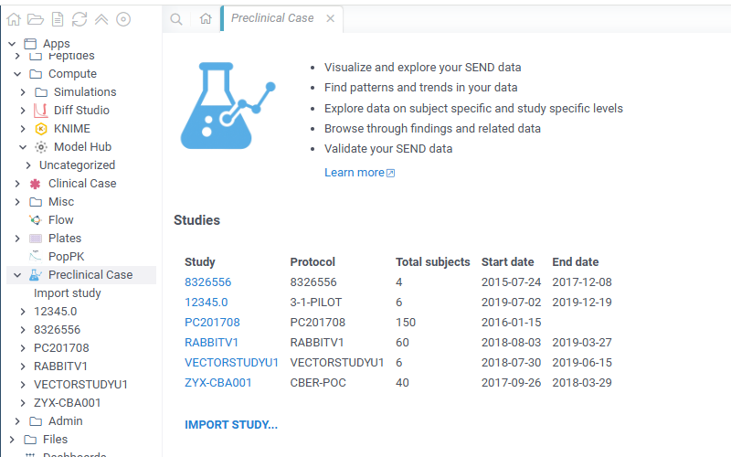

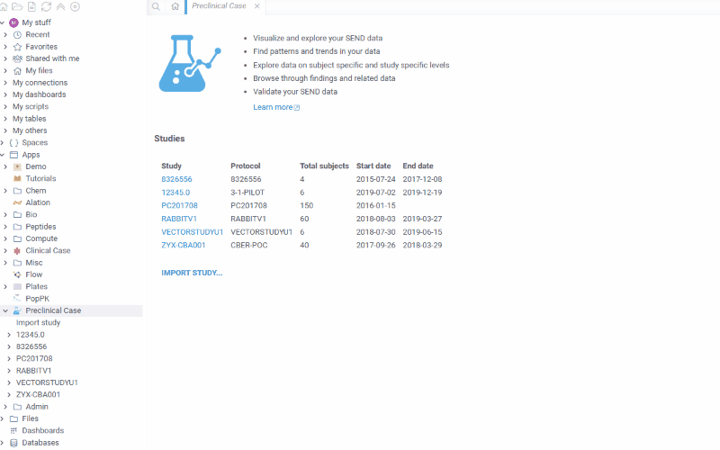

### Key Features

#### Data Import

To import a preclinical study:

- Launch the **Preclinical Case** application from the Apps menu
- Click **Import study** tree item
- Select SEND data files (`.xpt`, `.csv`, or `.xml` format)
- The application will automatically:
   - Detect the study from `define.xml`
   - Extract study metadata and summary
   - Load all SEND domains
   - Perform initial validation

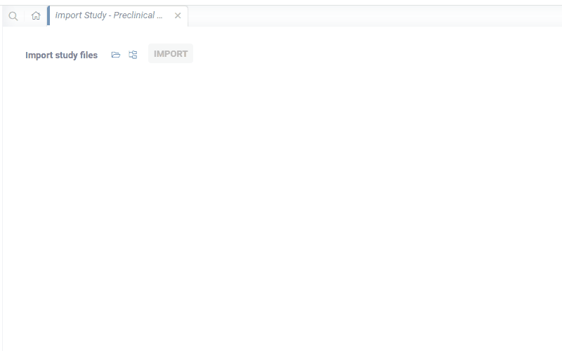

### Domains

Once imported, domains are easily accessible and can be added to the workspace for further analysis and examination. To select a specific domain, open the **Domains** tree group and choose the required one.

Domains are organized into categories:
- **Core / Special Purpose**: DM, CO, SC, SE, SM, SV, RELREC
- **Findings**: BW, BG, CL, EG, EY, FW, IG, IS, LB, MA, MB, MI, NC, OM, PC, PM, PO, RE, RP, SR, TF, VS
- **Events**: DS
- **Trial Design**: TA, TE, TS, TX
- **Pharmacokinetics / Modeling**: PP
- **Supplemental**: SUPP* domains

Domains are added as standard Datagrok table views, allowing you to:

- Add viewers and calculated columns
- Run custom scripts on the data
- Filter and link tables
- Enable validation error indicators

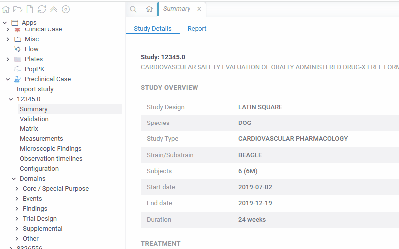

### Preclinical Case Views

Preclinical Case provides the following specialized views for analyzing preclinical data:

#### Summary

The Summary view provides an overview of the preclinical study, including:

- **Study Details** tab: study overview (species, strain, design), treatment information (route, frequency), administration details (sponsor, facility), list of loaded domains, and validation summary

Study metadata is extracted from the TS (Trial Summary) domain parameters.

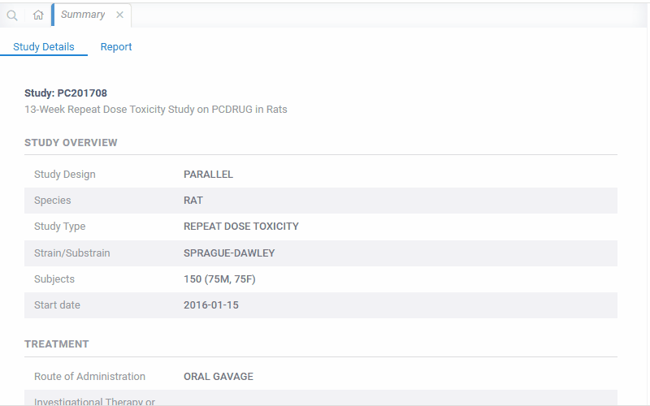

#### Validation

Validation is performed on study import using [CDISC Rules Engine](https://github.com/cdisc-org/cdisc-rules-engine) against SENDIG 3.1 standard.

The view consists of two linked tables:
- **Issue Summary** (top): list of violated rules with counts and affected datasets
- **Issue Details** (bottom): detailed violations filtered by the selected rule

To filter invalid domain rows, select the corresponding rule in the summary table. Cells with errors are marked with a red indicator. Hover over the mark to see the tooltip with details.

For some of the rules, fixes may be proposed. To apply a fix:

- Select the corresponding rule and click fix in the 'action' column
- Observe fixes preview in the context panel
- If satisfied with the fixes, click 'Apply fixes' on the ribbon panel

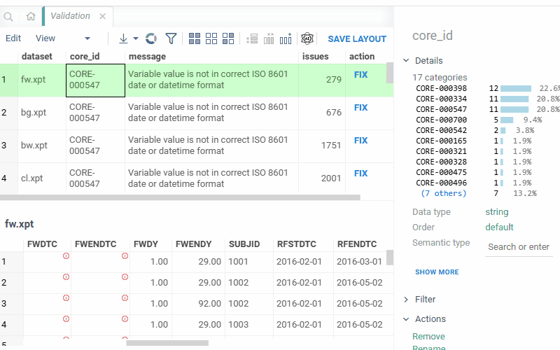

#### Matrix Table

A comprehensive matrix view that pivots laboratory and findings data:

- **Matrix Dataframe**: test results pivoted by animal and study day
- **Matrix Plot**: interactive matrix visualization showing relationships between tests
- **Filtering**: easily filter by any parameter, including demographic domain fields

This view is particularly useful for identifying patterns across multiple tests and animals simultaneously.

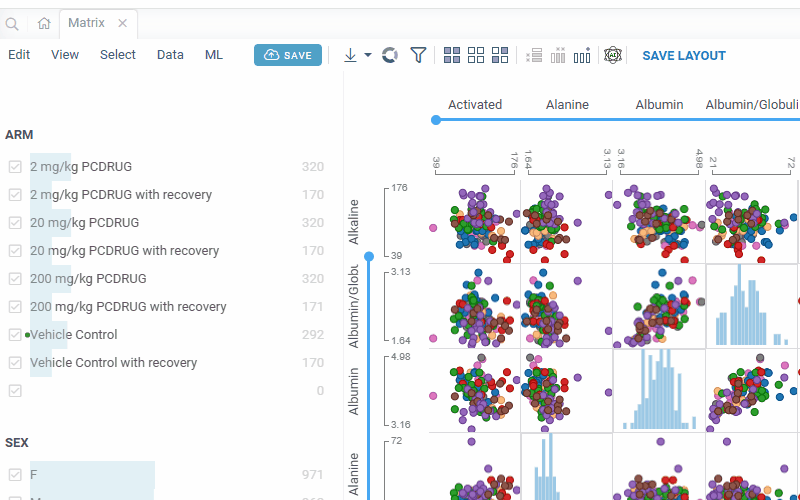

#### Measurements

Comprehensive analysis of all measurement findings across domains:

- Combines data from all findings domains (LB, BW, CL, EG, VS, etc.) into a unified table
- Baseline calculations with BLFL flag support (SENDIG v3.1.1) and earliest-day fallback
- Computed columns: baseline, change from baseline, percent change from baseline

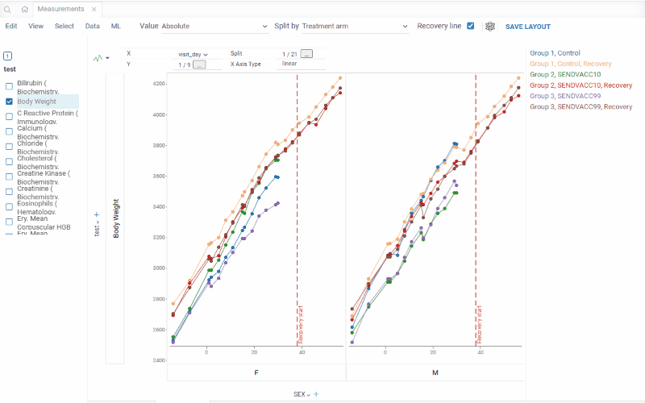

#### Microscopic Findings

Cross-domain analysis linking microscopic findings with laboratory data:

- Relationship between laboratory value distributions and microscopic findings severity
- Summary frequency table for all microscopic findings

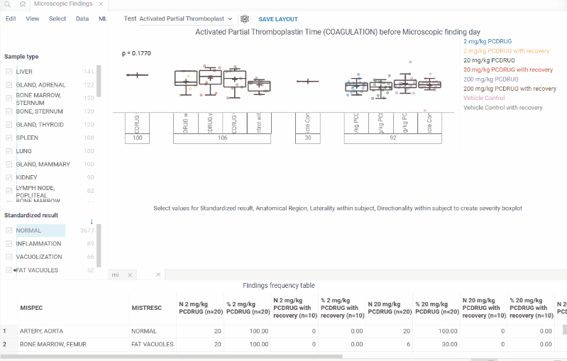

#### Observation Timelines

Timeline visualization of observations across animals and study days:

- Scatter plot cells showing value distributions by treatment arm at each visit day
- Color-coded by treatment arm for visual group comparison
- Click on individual data points to open the subject profile and connect the points
- Interactive filtering treatment arm, domain, test, and demographic parameters

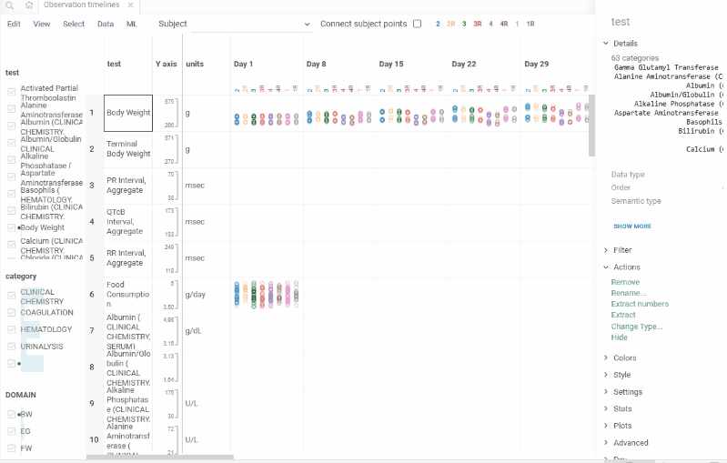

#### Configuration

Treatment and control arm mapping for comparative analysis:

- Define treatment-to-control arm pairings
- Once configured, enables control group comparison columns in the LB domain:
  - `CONTROL_MEAN` - mean control group value per test/visit
  - `DELTA_VS_CONTROL` - difference from control mean
  - `PCT_VS_CONTROL` - percent difference from control mean

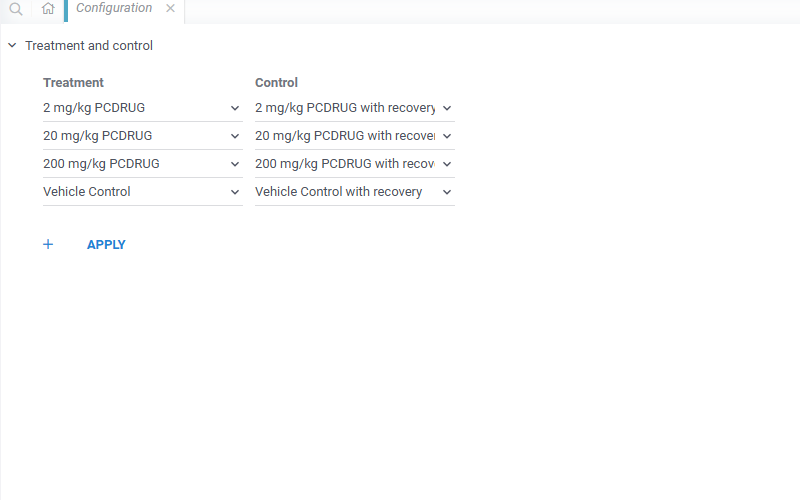

### Subject Profile

Click on a subject in Measurements or Observation Timelines views to see their individual profile:

- Accordion layout with expandable domain sections
- Animal-level data from all available domains
- Timeline of individual observations

## XPT File Support

The package registers a file handler for `.xpt` (SAS Transport) files, allowing you to open individual SEND domain files directly in Datagrok.

## See also

- [ClinicalCase](https://github.com/datagrok-ai/public/tree/master/packages/ClinicalCase) - sibling package for clinical SDTM data
- [CDISC SEND](https://www.cdisc.org/standards/foundational/send) - Standard for Exchange of Nonclinical Data
- [CDISC Rules Engine](https://github.com/cdisc-org/cdisc-rules-engine) - validation engine used for SEND data quality checks
