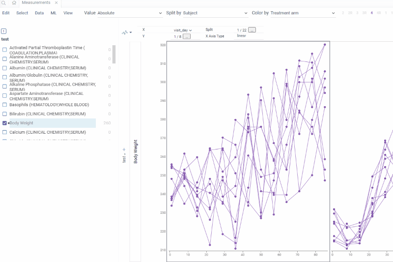

# Subject Profile

Individual animal profile view showing subject-specific data across all domains.

The view is displayed as an accordion with expandable sections for each available domain.

Each section shows the domain data filtered to the selected animal, allowing detailed examination of:
- Laboratory findings over time
- Clinical observations
- Body weight progression
- Microscopic and macroscopic findings
- Pharmacokinetic data
- Any other domain data available for the subject

