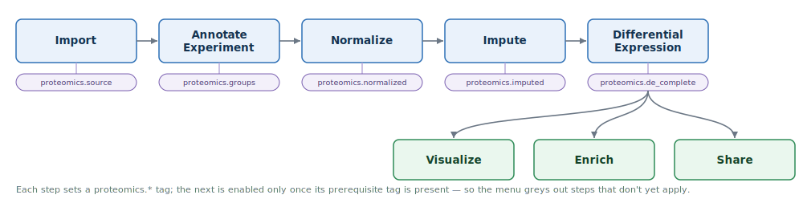
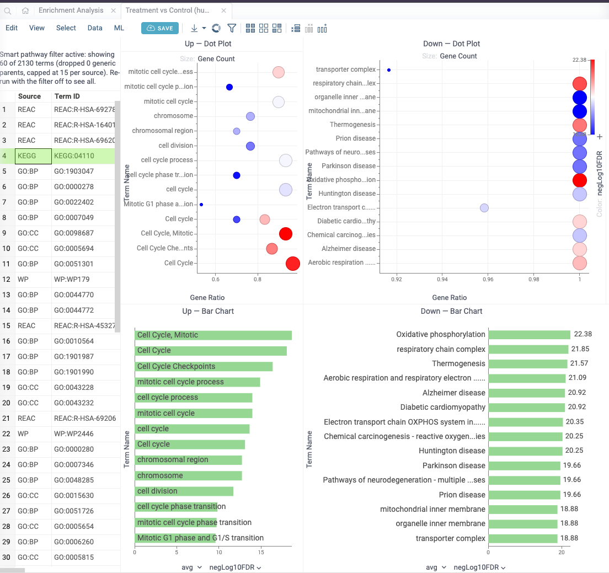
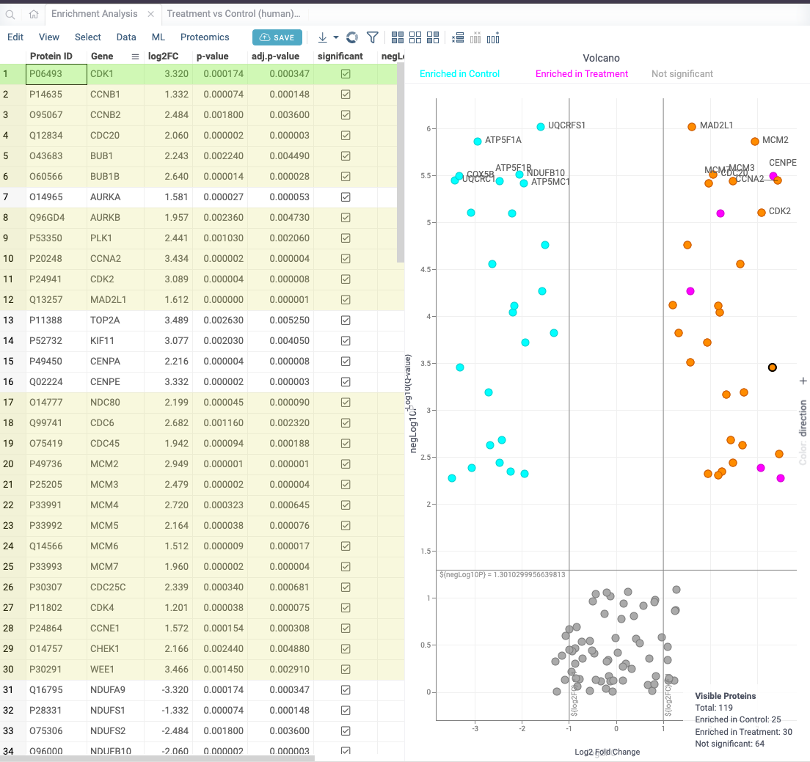

# Proteomics

Mass spectrometry-based proteomics data analysis [package](https://datagrok.ai/help/develop/#packages)
for the [Datagrok](https://datagrok.ai) platform.

It takes a study from raw search-engine output to a result a biologist can act on —
*which proteins changed, what pathways they implicate, and what each protein is* — and lets
you share that result as a read-only snapshot a collaborator can explore without touching
the raw data or writing a line of code. It covers **label-free quantitative proteomics**
from both **DDA** (MaxQuant, FragPipe) and **DIA** (Spectronaut) workflows.

Open it from the **Proteomics** top menu.


*One screen from statistics to biology: the interactive volcano, the clustered expression heatmap, and in-place UniProt annotation for the selected protein.*

## Where it fits

The package picks up **where the search engine leaves off** and carries the study all the
way to biological interpretation. It does not replace MaxQuant, FragPipe, DIA-NN or
Spectronaut, and it does not touch raw instrument files (`.raw`, `.mzML`, `.d`) — you
bring in the protein/quant table they produce. From there it stands in for the four-to-six
disconnected desktop tools and hand-exported files that normally sit between that table
and a finished figure: import, QC, statistics, interpretation, and sharing happen in one
place, and the result stays reproducible instead of scattered across scripts and
spreadsheets.

## What you can achieve

### If you generate the data — the proteomics scientist

- **Stand behind your quantification.** Normalization removes between-sample technical
  bias and principled missing-value handling deals with the dropout that is intrinsic to
  MS, so downstream fold-changes reflect biology rather than loading or detection
  artifacts.
- **Make a defensible significance call.** Statistics built for the small-sample,
  high-dimensional reality of proteomics (limma / DEqMS) give you a ranked, FDR-controlled
  list of changed proteins you can justify to a reviewer — not an ad-hoc cutoff.
- **Catch problems before they become false discoveries.** Per-run QC and longitudinal
  process control surface a mislabeled channel, a weak replicate, or instrument drift
  across a batch *before* it drives a result.
- **Hand off something reproducible.** Publish the finished analysis as a versioned,
  read-only snapshot — the collaborator sees exactly what you saw, and a later re-analysis
  supersedes rather than overwrites it.

### If you interpret the data — the biology scientist

- **See what changed.** An interactive volcano shows which proteins go up or down between
  your conditions and how strongly — sorted, labeled, and clickable, not a static figure.
- **Understand what it means.** Enrichment collapses a list of hundreds of changed
  proteins into the handful of biological processes, pathways, and complexes that are
  actually over-represented (GO, KEGG, Reactome, WikiPathways) — and selecting a pathway
  highlights its proteins back on the volcano, so statistics and biology stay connected.
- **Know what each hit is.** Click any protein to pull its name, gene, function, and
  subcellular location from UniProt, in place — no separate database lookups.
- **Explore it yourself.** Open the shared snapshot and filter, select, and cross-link
  interactively. You don't need the raw files, the analysis environment, or another round
  trip through the analyst to ask your own follow-up questions.

## Supported inputs

| Format | File | Notes |
|--------|------|-------|
| **MaxQuant** | `proteinGroups.txt` | DDA. LFQ / Razor / iBAQ intensities; contaminant & reverse-hit filtering |
| **Spectronaut — Report** | PG-level export | DIA. Pivots long-form precursor exports to a protein × sample matrix; streams multi-GB files; q-value filtering |
| **Spectronaut — Candidates** | pre-computed DE export | DIA. Already-computed fold-change / FDR per protein; skips straight to visualization |
| **FragPipe** | `combined_protein.tsv` | DDA. MaxLFQ / Intensity / Razor; Philosopher contaminant filtering |
| **Generic matrix** | any CSV/TSV | Column-mapping dialog; auto-detects delimiter and log2 status |

> DIA-NN is **not** currently supported as a direct importer — bring DIA-NN output in via
> the **Generic matrix** path, or as a Spectronaut-style matrix.

## Workflow

The pipeline runs as a sequence of steps from the **Proteomics** menu. Each step records
its completion on the table, and downstream steps read those as preconditions, so the
menu greys out actions that don't yet apply (and items that need per-sample intensities
are disabled on the pre-computed Spectronaut Candidates table).



### Import
`Spectronaut Candidates...` · `Spectronaut Report...` · `MaxQuant...` · `FragPipe...` ·
`Generic Matrix...` — also available from the left-bar main menu with no table open.

### Annotate
- **Annotate Experiment** — assign intensity columns to two named groups
  (e.g. Control vs. Treatment); required input for normalization, imputation, DE, PCA and
  enrichment.

### Analyze
- **Normalize** — median centering, quantile normalization, or VSN (variance-stabilizing;
  R, with a quantile fallback).
- **Impute Missing Values** — k-nearest-neighbor, MinProb (Perseus-style downshifted
  draw), mean, median, or zero.
- **Differential Expression** — DEqMS (peptide-count-weighted variance) → limma
  (empirical-Bayes moderated t-test) → client-side Welch's t-test, cascading down on
  availability. Adds `log2FC`, `p-value`, `adj.p-value` and a `significant` flag.
- **Enrichment Analysis** — over-representation against GO (BP/MF/CC), KEGG, Reactome and
  WikiPathways through g:Profiler, for 9 model organisms (human, mouse, rat, yeast,
  *E. coli*, zebrafish, fly, *Arabidopsis*, *C. elegans*), with optional smart GO pruning.
- **Compute SPC Status** — score the active run against an instrument-QC baseline.

### Visualize
- **Volcano Plot** — log2FC vs. -log10(p), with significance threshold lines; switch the
  significance metric, color by significance or UniProt subcellular location, and label
  the top-N proteins independently of selection.
- **Heatmap** — clustered expression heatmap of the top differential proteins.
- **PCA** — sample-level principal-component scatter (opens in its own view).
- **Group-Mean Correlation** — group1 vs. group2 mean per protein, with Pearson/Spearman.
- **QC Dashboard** — MA plot, coefficient-of-variation, missingness matrix and an
  intensity trend.
- **SPC Dashboard** — longitudinal control charts over instrument metrics
  (median intensity, missingness, replicate correlation, protein count) with Nelson-rule
  flagging and a Pareto of tripped rules.
- **Enrichment Charts** — dot plot and bar chart of the top terms, split Up/Down by
  direction; selecting a term highlights its proteins back in the volcano.

Selecting a term in the enrichment results highlights that pathway's member proteins back
on the volcano — a pathway you find in the biology view is immediately located in the
statistics view, so the two never drift apart:





*Selecting the KEGG Cell Cycle term (top) highlights its 25 member proteins on the volcano (bottom).*

### Share
- **Share Analysis for Review** — publish a trimmed, read-only snapshot (table + volcano +
  enrichment charts) to a reviewer group. The source table is never mutated; reviewer
  access is verified (and rolled back on an over-permissive grant); the snapshot is
  optionally re-opened and shape-checked to confirm it survives a reload; re-publishing
  supersedes the prior version. A **Shared Analysis** context panel surfaces the
  publication's audit trail.

## Protein annotation

Clicking a protein-ID cell opens the **UniProt** info panel, which fetches the protein
name, gene, organism, functional description, GO terms (MF / BP / CC) and KEGG / Reactome /
InterPro cross-references from the UniProt REST API and caches them in App Data.

## Semantic type detection

Columns are auto-detected and tagged so the package keeps working on tables from vendors
it hasn't seen — detectors match on column-name hints and validate sample values.

| Semantic type | Detects |
|---------------|---------|
| `Proteomics-ProteinId` | Protein IDs, Majority Protein IDs, UniProt, Accession (validated against the UniProt accession pattern) |
| `Proteomics-GeneSymbol` | Gene Names, Gene Symbol, Gene |
| `Proteomics-Log2FC` | columns naming "log2" with "fc"/"fold" |
| `Proteomics-PValue` | p-value, adj.p, FDR, q-value (range 0–1) |
| `Proteomics-Intensity` | Intensity, LFQ / Reporter / Razor / MaxLFQ Intensity, iBAQ |
| `Proteomics-SubcellularLocation` | UniProt subcellular-location strings |
| `Proteomics-DisplayName`, `Proteomics-SourceId` | gene-label resolver fields |
| `Proteomics-NumeratorMean`, `Proteomics-DenominatorMean` | per-group means in Spectronaut Candidates exports |

## Integrations & requirements

- **No credentials required.** The package calls only public REST APIs — UniProt (protein
  annotation) and g:Profiler (enrichment).
- **R is optional.** `limma_de.R`, `deqms_de.R` and `vsn_normalize.R` run server-side and
  require a configured Datagrok R compute environment; every R path has a client-side
  TypeScript fallback, so the package is fully functional without R.

## Demo data

Example datasets ship in `files/demo/` (see its `README.md`):

- `proteinGroups.txt` — small MaxQuant example
- `cptac-spike-in.txt` — CPTAC UPS spike-in reference with known concentrations
- `fragpipe-smoke-test.tsv` — FragPipe `combined_protein.tsv` example
- `spectronaut-hye-candidates.tsv` — Spectronaut Candidates (pre-computed DE)
- `spectronaut-hye-precursor.tsv` / `spectronaut-hye-mix.tsv` — Spectronaut long-form reports

## Development

```bash
cd packages/Proteomics

npm run build              # grok api && grok check --soft && webpack
grok publish local         # build + publish to your configured server
grok link && npm install   # link local datagrok-api / @datagrok-libraries
grok test --host localhost # run the package tests
```

## See also

- **TODO:** Datagrok Proteomics documentation — the help page at
  `https://datagrok.ai/help/domains/bio/proteomics` does not exist yet and still needs to
  be written.
