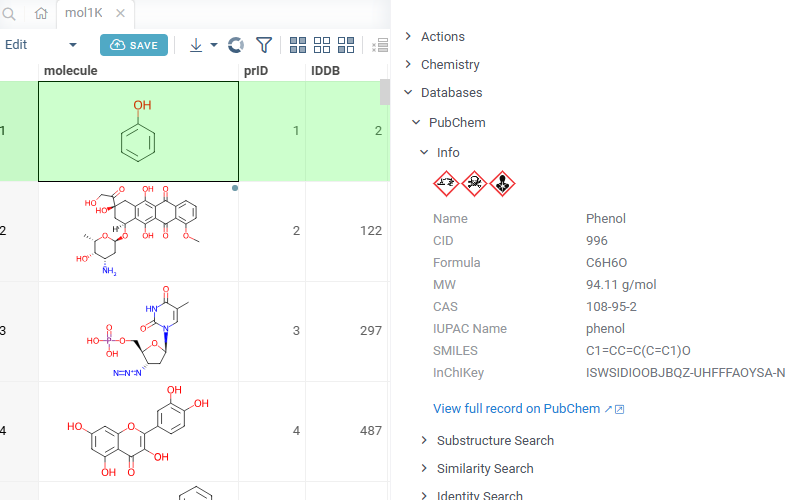
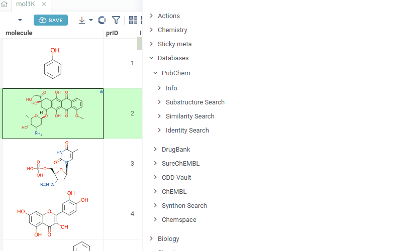

# PubChem

PubChem is a [package](https://datagrok.ai/help/develop/#packages) for the [Datagrok](https://datagrok.ai)
platform that integrates the public [PubChem](https://pubchem.ncbi.nlm.nih.gov/) compound database into
any `Molecule` column.

The package adds four panels to the context pane and two type converters to Datagrok's semantic type system,
so structures already in your grid can be looked up, searched, and cross-referenced against PubChem without
leaving the platform.

> Note: the package queries an external service. Structures you search with are sent to PubChem as URL
> parameters.

## Features

### Info panel

For every molecule in the grid, the **Databases | PubChem | Info** panel resolves the structure to a
PubChem CID via exact-match lookup and shows the curated identifiers pulled from PubChem's `pug_view`
endpoint:

- Name (RecordTitle) and CID
- Molecular Formula, Molecular Weight
- CAS, IUPAC Name, SMILES, InChIKey
- GHS hazard pictograms (Corrosive / Acute Toxic / Health Hazard / …) when PubChem classifies the
  compound as hazardous

A single link opens the full PubChem record in a new tab.

### Substructure / Similarity / Identity search

Three panels under **Databases | PubChem** query the corresponding PubChem `fast*` search endpoints
and render the top 20 hits as a scrollable grid of 2D structure cards. Each card shows the CID in a
tooltip and opens the full PubChem record on click; similarity hits are re-ranked locally with
`grok.chem.findSimilar` (cutoff 0.75) and annotated with a similarity score.

- **Substructure Search** — PubChem's substructure matching over the whole database
- **Similarity Search** — 2D fingerprint similarity, locally re-ranked
- **Identity Search** — exact match; shows a table of all structural identifiers PubChem has on file
  (absolute/connectivity SMILES, InChI, InChIKey, IUPAC names, XLogP3, H-bond counts, etc.)

An arrow icon above the grid opens the full hit list as a Datagrok table view for downstream analysis.

### Type converters

Two semantic-type converters are registered so that PubChem identifiers pasted into any SMILES-aware
input (cell, filter, parameter) are resolved to a structure automatically:

- `pubchem:<CID>` — e.g. `pubchem:2244` → SMILES for aspirin
- Any InChIKey (27-char `XXXXXXXXXXXXXX-XXXXXXXXXX-N`) → SMILES for that compound

### `GetIupacName` function

A server-callable function that takes a SMILES string and returns the IUPAC name from PubChem.
Available from scripts, queries, and JS via `grok.functions.call('PubChemApi:GetIupacName', {smiles})`.

## See also

- [PubChem PUG REST documentation](https://pubchem.ncbi.nlm.nih.gov/docs/pug-rest)
- [Similarity Search in Datagrok](https://datagrok.ai/help/datagrok/solutions/domains/chem/#similarity-and-diversity-search)
- [Chem package](https://github.com/datagrok-ai/public/tree/master/packages/Chem)
