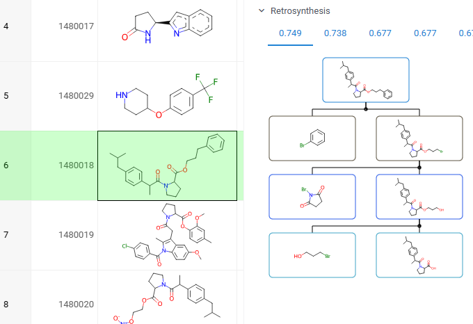
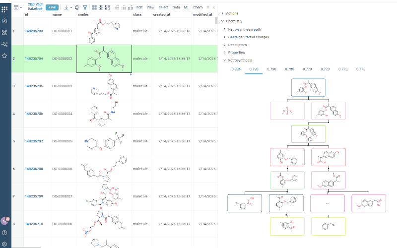
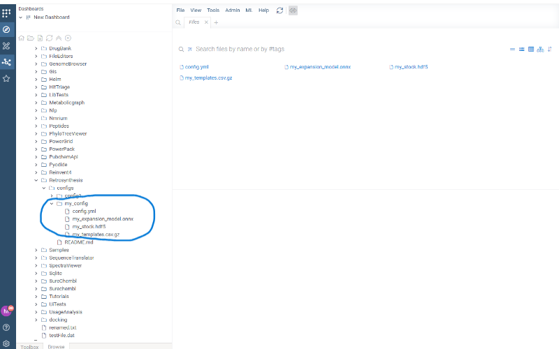
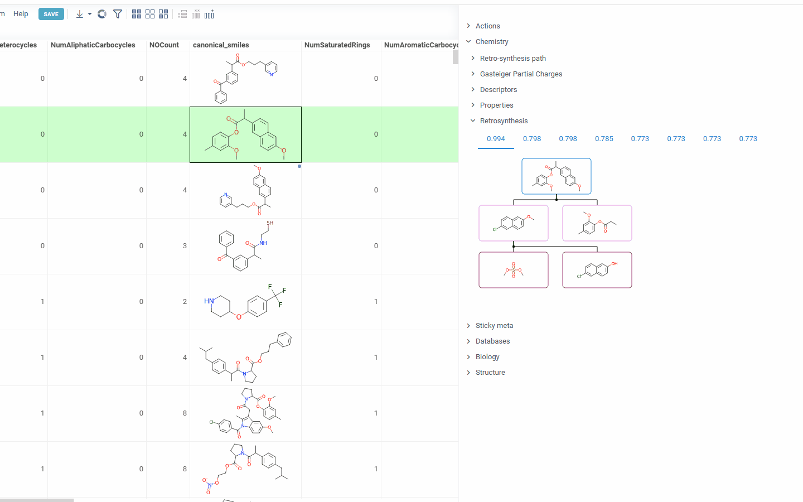

# Retrosynthesis

Works backward from a target molecule (the desired final product) to identify simpler,
commercially available starting materials and the synthetic reactions needed to reach the target. This plugin is powered by an integration with [AiZynthFinder](https://github.com/MolecularAI/aizynthfinder), an open-source tool for retrosynthetic planning.

To use, click or sketch a molecule, and expand the "Retrosynthesis" context panel on the right:

Hover over the graph and click _plus_ icon to add the tree to the workspace.

You can add custom models, stocks and configurations to use them for paths generation. To do that:

- create a folder with your custom configuration name under AppData/Rerosynthesis/configs and place your custom files there. Minimum required files are:

  - expansion model
  - file with templates
  - stock file
  - config.yml with paths to your files (and other parameters if required). Paths to files should be recorded as follows:
 /app/configs/<your_custom_config_name>/<file_name>. *Proper paths naming is very important!!!* 
 Below is the example of config.yml contents:

expansion:
  full:
    - /app/configs/my_config/my_expansion_model.onnx
    - /app/configs/my_config/my_templates.csv.gz
stock:
  my_stock: /app/configs/my_config/my_stock.hdf5

- click _settings_ icon and choose your custom configuration as current

