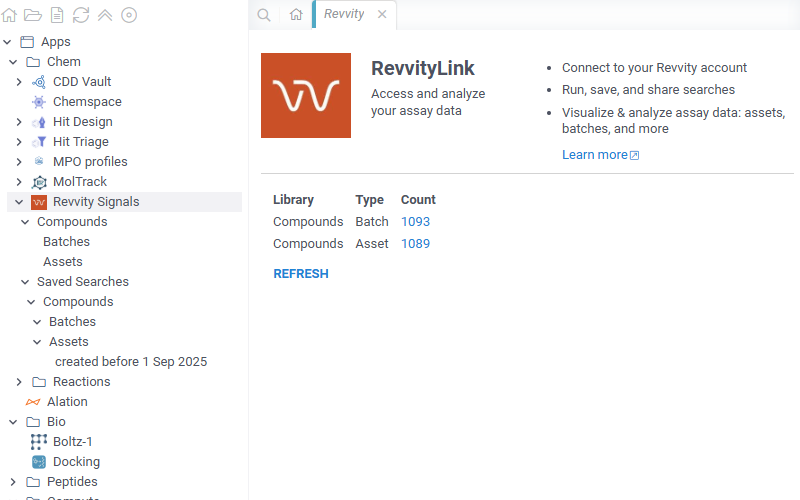
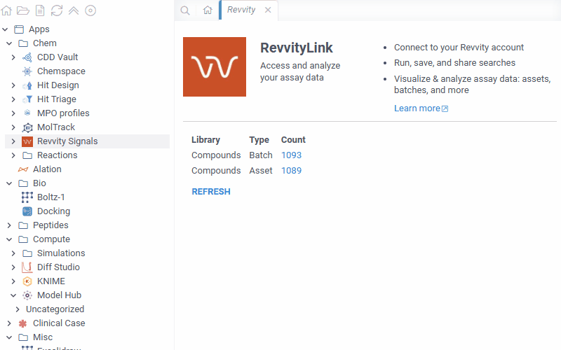
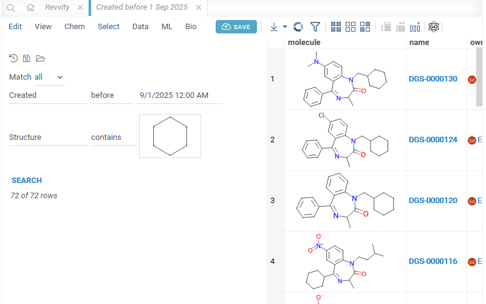
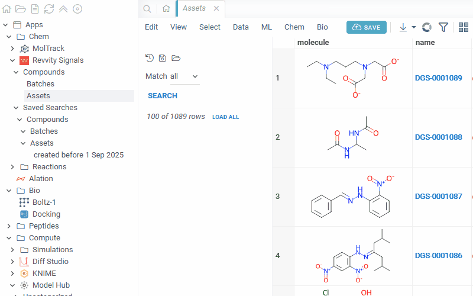
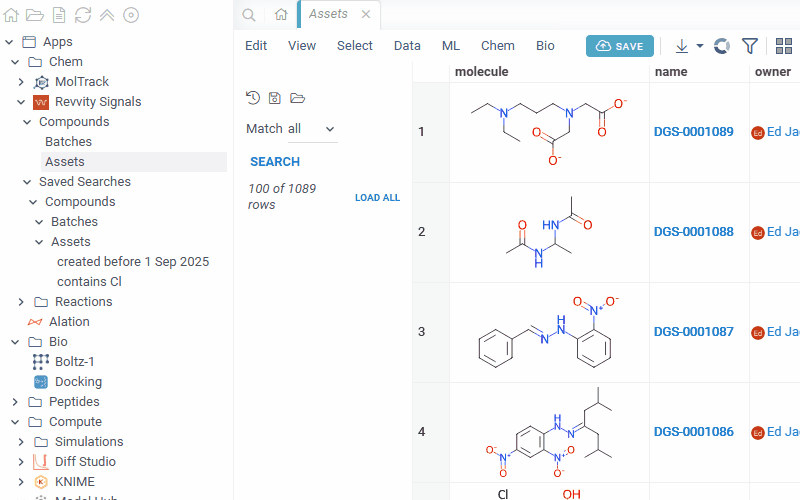
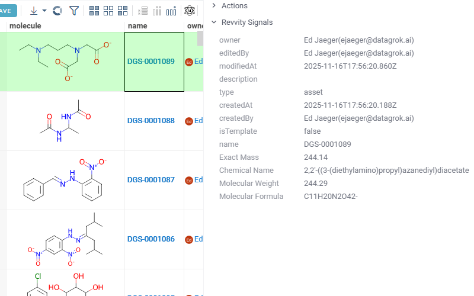
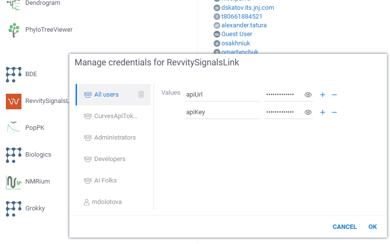

# RevvitySignalsLink

`RevvitySignalsLink` is a [Datagrok](https://datagrok.ai) [package](https://datagrok.ai/help/develop/develop#packages) that integrates with
[Revvity Signals](https://revvitysignals.com/), a cloud platform for managing scientific data
(compounds, batches, assays, registrations) used in drug-discovery labs.

It lets scientists browse their Revvity materials libraries inside Datagrok, build and run
complex searches through a visual query builder, visualize results alongside molecule
structures, save and share named searches, and see rich info panels on any Revvity
compound ID encountered across the platform.

## Features

### Browse libraries and entity types

Navigate your Revvity materials libraries and their entity types (assets, batches, samples)
from the Datagrok browse tree. Selecting a library or a type opens a table preview with
automatically detected molecule columns.

### Visual query builder

Every library/type view ships with a filters panel backed by Datagrok's query builder.
Filters include:

- Default system fields (`createdAt`, `modifiedAt`, `createdBy`, `editedBy`, `Structure`)
- Tags automatically discovered per library/entity type
- `createdBy` / `editedBy` with typeahead user search
- Structure search (substructure + similarity)

### Saved searches

Save any query as a named search, scoped to the `library | entityType` combination, and
reload it in one click from the **Saved Searches** branch of the browse tree.

### Molecule structures

Asset/batch/sample results render with inline molecule structures, loaded in batched
background requests with a cancellable progress indicator. Large result sets (beyond the
100-row default page) can be loaded on demand via a **Load all** action.

### Info panels on Revvity IDs

The package auto-detects Revvity corporate IDs (e.g. `DGS-0000001-001`) anywhere in
Datagrok — grids, files, chat — and surfaces a context panel with the entity's
attributes, related entities, and linked users.

### Shareable URLs

Any view (library, entity type, active query, or saved search) has a stable URL that can
be copied from the address bar and shared with another Datagrok user with access to the
same Revvity instance.

## Setup

The package reads two parameters from package credentials:

| Parameter | Purpose                                       |
|-----------|-----------------------------------------------|
| `apiKey`  | Revvity Signals API key (header `x-api-key`)  |
| `apiUrl`  | Base URL of your Revvity Signals tenant API   |

Configure them via **Manage → Packages → RevvitySignalsLink → Credentials**. 

## Permissions

- Most endpoints require a valid API key. If the key's role does **not** grant access to
  `/users`, the package falls back to extracting user information from the `included`
  section of search responses — the app still works, but user typeahead in the query
  builder will be empty.
- All REST traffic goes through `grok.dapi.fetchProxy`, so CORS is handled by the
  Datagrok server and no additional browser permissions are required.

## See also

- [Datagrok platform](https://datagrok.ai)
- [Revvity Signals](https://revvitysignals.com/)
- [Package development guide](https://datagrok.ai/help/develop/develop)
