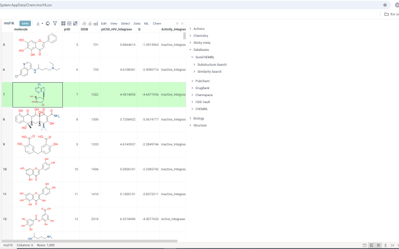
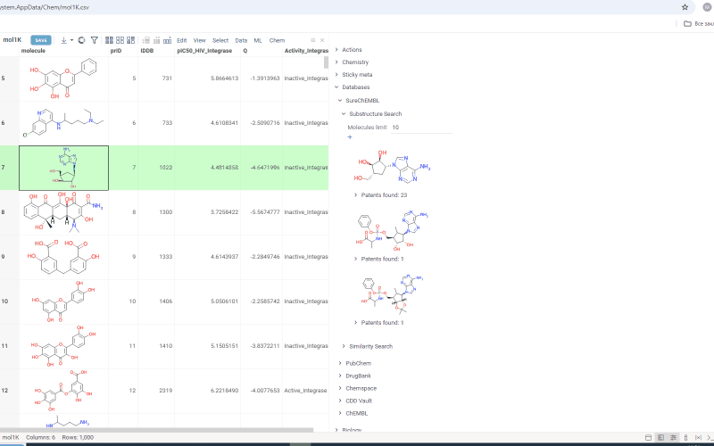

# SureChEMBL

SureChEMBL is a [package](https://datagrok.ai/help/develop/#packages) for the [Datagrok](https://datagrok.ai) platform.
It allows you to perform searches through a locally deployed [SureChEMBL] (https://www.surechembl.org) database. The SureChembl database is deployed automatically within a docker container when the package is installed. You can search either by similarity or substructure.
To run the search:

* open context panel and select cell with molecule structure
* on the context panel go to *Databases* -> *SureChEMBL* -> *Substructure Search*/*Similarity Search*. Molecules containing the initial molecule as a substructure (or similar molecules, in case you open a similarity search) will appear under the tab.
* change the number in the *Molecules limit* field to show more or fewer molecules in the result
* change the similarity cutoff using the *Similarity cutoff* slider
* click the *plus* icon to add all patents found for molecules in the results as a table view

Search results are shown under the *Substructure Search*/*Similarity Search* tab. Similarity search results are sorted by similarity score and the score is indicated above the molecule.
Under each molecule, there is a tab with a number indicating in how many patents this molecule has been mentioned. Open the tab to investigate patents more closely. Or hover over the tab and click *plus* icon to add patents to workspace as a table view. The patents grid contains several fields including *id*. *Id* filed is a link. Click on the link to go to a page with corresponding patent on a SureChEMBL resource.

See also:

* [Grok API](https://datagrok.ai/help/develop/packages/js-api)
* [Packages](https://datagrok.ai/help/develop/#packages)
* [Data Connection](https://datagrok.ai/help/access/#data-connection)
* [Data Query](https://datagrok.ai/help/access/#data-query)
* [Info Panels](https://datagrok.ai/help/explore/data-augmentation/info-panels)
* [Semantic Types](https://datagrok.ai/help/govern/catalog/semantic-types)
