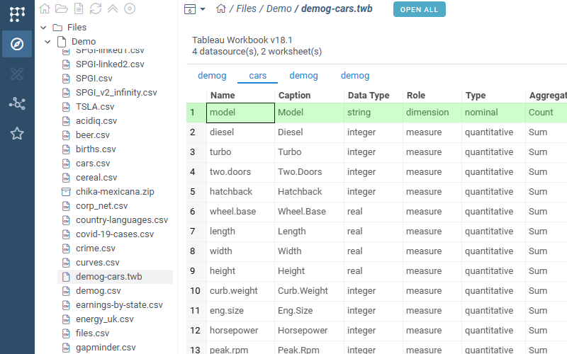

# Tableau

Datagrok plugin for importing and previewing Tableau workbook (.twb) files.

## Features

- **File importer**: Extracts datasource column schemas from .twb files as DataFrames
- **File viewer**: Tab-based preview with one tab per datasource, plus an "Open All" button

## Supported Format

| Extension | Format                          |
| --------- | ------------------------------- |
| `.twb`    | Tableau Workbook (XML)          |

Each datasource in the workbook produces a DataFrame with columns:
Name, Caption, Data Type, Role, Type, Aggregation, Contains Null.
