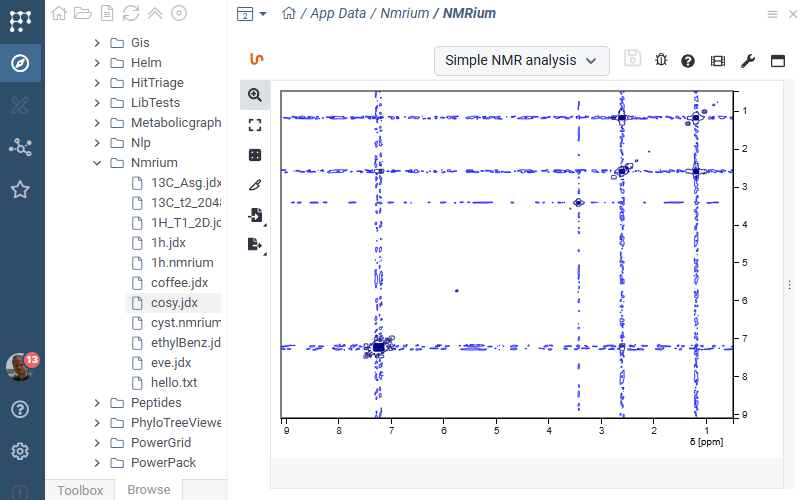

# NMRium

NMRium is a file viewer for NMR data, built on top of the awesome 
[NMRium library](https://github.com/cheminfo/nmrium). 

Just click on the .jdx file in the browse tree, and the
interactive analysis appears in the preview pane.



## To build:

```
npm i && npm run build && grok publish
```